

 1.1 Общий вид метрического классификатора. Близость к классу. kNN, Radius Neighbors. Leave-one-out error.

[Момент в лекции](https://youtu.be/AySw5WqkEKo?si=OrnawN2F2sZ4kTn8&t=3171)\
D - наши данные\
$x_i$ - один набор фичей\
**Метрический классификатор** - означает, что считаем расстояние между объектами и как-то по этому классифицируем\
Общей вид: $h(x; D) = argmax_{y \in Y}(\sum_{x_i \in D} 1_{y_i=y} * w(x_i, x))$\
Такая сумма $Г_y(x) = \sum_{x_i \in D} 1_{y_i=y} * w(x_i, x)$ называется **близостью к классу y**.

### Пример:
Возьмём Евклидово расстояние и для самой ближайшей точке к x, назовём её z, зададим значение w(x, z) = 1. Для всех остальных w(x,k)=0. То есть\
$w(x,z) = 1$, if $z = argmin_v(\rho(v, x))$\
$w(x,z) = 0$, else\
Теперь наш классификатор новой точке присваивает тот же класс, что и у самой ближней к нему.\
\
Но это может быть не всегда корректно, давайте смотреть на k ближайшех соседей - получили **kNN (k-nearest-neighbors)**\
$h(x; D) = argmax_{y \in Y}(\sum_{x_i \in D} 1_{y_i=y} * w(x_i, x))$\
$w(x_i, x) = 1, if x_i$ - один из k-ближайших соседей x\
$w(x_i, x) = 1, if distance \rho(x_i, x) < R$, то же самое, что и выше, только берём не k соседей, а всех кто лежит в заданном радиусе, такое R называем **Radius Neighbors**.\
**Важно:** векторное пространство (ВП) не нужно, только заданное растояние. Например расстояние между строками считать умеем, а ВП нет.\
\
\
Если у нас получилось поравну нескольких классов, то чтобы конкретезировать будем брать первый по алфавиту или любой другой детерменнированной стратегии (чтобы всё повторялось).\
\
Для определения лучшего k (сколько брать соседей), будем смотреть на ошибку **Leave-one-out error** (LOO)\
$LOO(k, D) = \frac{\sum_{x_i \in D} [h(x_i;D \backslash x_i;k) \neq y_i]}{|D|}$, то есть поочереди выкинули из данных каждую строчку и посмотрели сколько раз не угадали. 0 - всё угадали, 1 - ничего не угадали.

## 1.2 Регрессия. LASSO, LARS, Elastic Net.
[Момент в лекции](https://youtu.be/oJ_cnAQ3ViA?si=28pfkUkypVRMcog2&t=4362)\
Этот билет продолжает разговор о регулезации в билете 8.2 (гребневая регрессия).\
Хотим уменьшить variance. Для этого используем **LASSO (Least Absolute Shrinkage and Selection Operator)**\
$L_{lasso} = ||Xw-Y||_2^2 + \alpha * ||w||_1$, то есть к обычно регрессии прибавляем абсолютные значения весов. Это усложняет решение и зануляет фичи. Для объяснения второго можно воспользоваться геометрическим доказательством (фото). ||w|| - выглядит как ромб, а ||Xw-y|| - как элипс. Их контакт будет в вершине ромба. Хотим контакт, так как мы минимизируем сумму и если касания нет, то можем что-то уменьшить, сохранив другое и тогда общая сумма уменьшится.\
\
\
Для решения LASSO используем **LARS (Least Angle regression)**:
1) Берём одну фичу $x_i$, у которой наибольшая коореляция с y. (Если нарисовать в виде вектором, то это вича с наименьшим углом)
2) Будем собирать нашу итоговую функцию по чуть-чуть. Сейчас он равна $h = \beta_1 * x_i$
3) Увеличиваем $\beta$, пока не найдем другую фичу с большей коореляцей, назовём её $x_j$ и зададим её $\beta_2$
4) Повторяем. Все предыдущие бетты, кроме последней фиксируем.
5) Останавливаемся, когда сумма коэффициентов (умноженная на $\alpha$) превысит уменьшение ошибки

**Elastic Net** представляет из себя объединение L1 и L2 (L1 из Lasso и L2 из гребневой регрессии):\
$L_{elastic} = ||Xw-Y||_2^2 + \alpha*(1-p)*||w||_2^2 + \alpha\*p\*||w||_1$, здесь есть 2 коэффициента $\alpha$ - сила штрафа за фичи и p - доля L1 регулезации.\
\
\
### Предсказание на доп вопросы:\
$R^2-score$\
$R^2 = 1 - \frac{u}{v}$\
$u = \sum (h(x_i) - y_i)^2$, это MSE нашей функции\
$v = \sum (y^- - y_i)^2$, где $y^- = \frac{1}{N}\sum y_i$, то есть v - это MSE при константе как предсказании\
При чём тут процент объяснённой дисперсии?\
$R^2 = 1 - \frac{u}{v} = \frac{v-u}{v}$\
v - дисперсия, то есть в знаменателе остаётся столько, сколько мы объяснили. Если u приближается к v, то ничего не объяснили. По факту ничего этог нет, но можно так думать.

## 2.1 Тренировочная, валидационная и тестовая выборка. Валидация и неравенство Хёфдинга. Кроссвалидация.
[Лекция](https://youtu.be/AySw5WqkEKo?feature=shared&t=4185)

У нас есть датасет $D$. Хотим научиться решать произвольную задачу, например классификации, на основе этого датасета, т.е. хотим как-то понимать качество полученного решения.

**Идея 1**: выделим 10-20% датасета (*тестовая выборка*), замаскируем ответ на тестовой выборке, и будем оптимизировать модель (e.g. оптимизировать гиперпараметры) на каждом этапе на основе результатов на этой тестовой выборке.

Проблема: если слишком много гиперпараметров, можем переобучить модель. Модель может обучиться отвечать исключительно хорошо на тестовой выборке, но в целом очень плохо по всем возможным входным данным.

**Идея 2**: Уберем тестовую выборку из датасета и выделим ещё 10-20% датасета (*валидационная выборка*). Будем оценивать модель во время обучения на валидационной выборке, а оценивать общее качество уже обученной модели уже непосредственно на тестовой выборке.

При этом зачастую производят *кроссвалидацию*: оставшиеся 80% датасета после удаления тестовой выборки делят на $n$ равных частей (*фолдов*), каждый из которых по очереди выбирается в качестве валидационной выборки, а остальные $n - 1$ формируют тренировочную выборку.

</img>

### Неравенство Хёфдинга (вообще билет пиздецовый, поскольку по сути включает в себя ещё часть билета 12 и 13)

[Лекция](https://youtu.be/8RM6OYFjW1g?feature=shared&t=2528)

Вспоминаем определения:

* $N$ - размер датасета
* $h(x)$ - гипотеза 
* $f(x)$ - верная функция, её не знаем, хотим приблизить/угадать/оценить/смоделировать/прочее(необходимое подчеркнуть)
* $e(h, f)$ - функция ошибки. Зависит от класса задачи. Например, в задачах классификации $e(h(x_n), f(x_n)) = 1$ если класс $x_n$ в гипотезе ($h(x_n)$) совпал с ответом ($f(x_n)$), и $0$ иначе
* $ E_{in}(h) = \frac{1}{N}\sum_1^N e(h(x_n), f(x_n)) $ -- средняя ошибка гипотезы внутри датасета
* $ E_{out}(h) = \mathbb{E}_x\left[e(h(x), f(x))\right] $ -- средняя ошибка гипотезы на всех возможных датасетах. Обычно $E_{out}$ мы не знаем и хотим оценивать как-то математически.

Утверждение (*неравенство Хёфдинга*):

$$ \mathbb{P}\left[|E_{in}(h) - E_{out}(h)| > \varepsilon \right] \leqslant 2e^{-\varepsilon^2 N} $$

Без доказательства

Главный вывод: при больших $N$ можем с достаточно большой уверенностью что-то утверждать про качество классификатора.

Новое обозначение: $ |E_{in}(h) - E_{out}(h)| $ -- называется *Generalization error* (термин неустойчивый)

Теперь пусть у нас была не 1 гипотеза а $M$ гипотез. Тогда неравенство обращается в вид:

$$ \mathbb{P}\left[|E_{in}(h) - E_{out}(h)| > \varepsilon \right] \leqslant M2e^{-\varepsilon^2 N} $$

Тоже без доказательства.

*таймскип на билет 12.1 и 13.1*

Заметим, что при проверке на валидационной выборке неравенство имеет первый вид (поскольку на валидационной выборке мы проверяем ровно одну гипотезу в процессе обучения модели). То есть, при достаточно большой валидационной выборке мы умеем достаточно хорошо оценивать $E_{out}$.

## 2.2 Нейронные сети. Обратное распространение градиента.

[Лекция](https://youtu.be/kzhP504D4v8?feature=shared&t=2540)

Хотим обучать нейронную сеть, которая сложнее, чем один слой перцептронов.

Обозачения:

* $L$ - номер последнего слоя нейронной сети (нумерация слоев с 1)
* $L(w)$ - дифференцируемая функция потерь. Например, NLLL 
* $w^l_{jk}$ - вес между нейроном $j$ в слое $l - 1$ и нейроном $k$ в слое $l$
* $s^l_j = \sum_i w^l_{ij} x^{l-1}_i$ - входящий сигнал на нейрон $j$ слоя $l$
* $x^l_j = \sigma\left(\sum_i w^l_{ij}s^{l-1}_i\right)$ - исходящий сигнал из нейрона $j$ слоя $l$ после применения дифференцируемой функции активации $\sigma$. Устанавливаем начальные значения на первом слое как $x^1_j = x_j$

Общая задача, хотим научиться считать градиент $L$ для произвольных весов, то есть:

$$ \nabla L_{w^l_{ij}}(w) := \frac{\partial L(w)}{\partial w^l_{ij}} = \frac{\partial L(w)}{\partial s^l_j} \times \frac{\partial s^l_j}{\partial w^l_{ij}} $$

(замена переменной)

Заметим что, 
$$ \frac{\partial s^l_j}{\partial w^l_{ij}} = x^{l-1}_i $$

А левую кракозябру просто обозначим буквой: 
$$ \delta^l_j := \frac{\partial L(w)}{\partial s^l_j} $$

Суть: считаем все дельты начиная от последнего слоя к первому.

На последнем слое:

$$ \delta^L_i = \frac{\partial L(w)}{\partial s^L_i} $$

Более того, мы знаем, что $x^L_i = \sigma(s^L_i)$, а значит, мы можем явно посчитать $\delta^L_i$ (замена переменной)

А тогда мы умеем пересчитывать дельты на предыдущих слоях:

$$ \delta^{l - 1}_i = \frac{\partial L(w)}{\partial s^{l-1}_i} = \sum_j \frac{\partial L(w)}{\partial s^l_i} \times \frac{\partial s^l_j}{\partial x^{l-1}_i} \times \frac{\partial x^{l-1}_i}{\partial s^{l - 1}_i} = \sum_j \delta^l_j \times w^l_{ij} \times \sigma'(s^{l-1}_i) $$

(дважды заменили переменную: $ s^l_i \rightarrow x^{l-1}_i \rightarrow s^{l - 1}_i $)

Получаем алгоритм:

1. Инициализируем веса рандомно
2. Forward: просчитываем все $x$ и $s$
3. Backward: просчитываем $\delta$
4. $w^l_{ij} \leftarrow w^l_{ij} - \eta x^{l-1}_i\delta^l_j$
5. Повторяем с шага 2, пока не достигнем катарсиса

 3.1 Оценка классификатора. Точность, полнота. Фронт паретто. ROC кривая и AUC

[Момент в лекции](https://youtu.be/j1zFT3ep6O0?list=PLxMpIvWUjaJsttwLkYi-uEydy6R9Hk2-v&t=1313)\
Таблица, описывающая все случаи того, что может произойти с классификатором

Сверху указан реальных класс\
h($x_i$) - то, что выдает наш классификатор\
Возможно 4 случая:

1) True positive - точка принадлежит классу и мы правильно ее отнесли
2) True negative - точка не принадлежит классу и мы ее к классу не отнесли
3) False positive - точка не принадлежит классу, но мы ее отнесли к нему
4) False negative - точка принадлежит классу, но мы ее не отнесли к нему\

По сути последние 2 случая можно определить как ошибки первого и второго рода

Метрики:\

1) Точность или аккуратность\
   $Accuracy = \frac{TP\ +\ TN}{TP\ +\ FP\ +\ TN\ +\ + FN}$\
   Проблема случается, когда классы несбалансированны.\
   К примеру рак встречается не так часто, пусть 1%\
   Тогда можем представить очень простой классификатор, который говорит, что рака в принципе не существует, все точки
   будем
   классифицировать как доброкачественные (на самом деле их 99%).
   Таким образом получим, что accuracy будет равен 99%
2) $Precision = \frac{TP}{TP\ +\ FP}$
3) Полнота (Recall, True positive rate) \
   $\frac{TP}{TP\ +\ FN}$
4) $False\ positive\ rate = \frac{FP}{FP\ +\ TN}$

Заметим, что полнота с precision связаны обратно пропорционально. Однако обе метрики мы хотим как можно больше
и часто нужно решать чем пожертвовать в определенных ситуациях.

Помимо есть метрика:\
$$F_1score = \frac{2}{\frac{1}{recall}\ + \frac{1}{precision}} =2 \frac{precision\ *\ recall}{precision\ +\ recall}$$

### Фронт Парето

Допустим мы сделали много экспериментов, разные классификаторы, threshold и получилось пространство precision/recall,
каждая точка которого - классификатор.

Серые точки нам не интересны, так как над ними есть классификаторы, лучшие и по precision и по recall.\
Самые хорошие точки по этим метрикам и называются Фронт Парето (красные точки)

### ROC кривая и AUC

На картинке представлены 2 классификатора с разными threshold, получились 2 кривые. Синий точно лучше, чем зеленый.\
На картинке справа есть 3 точки. Верхняя отображает случай, когда все точки попали в положительный класс, средняя -
подбрасывание монетки, нижняя - все в отрицательный класс.\
Чем ближе к диагонали, тем хуже классификатор.\
Хотим наибольший AUC (Area Under ROC Curve, площадь под roc кривой)

### Предсказание на доп вопросы:

1) При увеличении threshold увеличивается precision или recall?\
   Ответ: Precision, так как threshold прямо пропорционален ему
2) Почему худшая площадь под ROC кривой 0.5, а не > 0.5?
   Ответ: Потому что в таком случае мы хорошо угадываем классы, но путаем их. Если поменять местами классы, то кривая
   отразится и площадь станет > 0.5.

## 3.2 Сверточные нейронные сети. VGG, GoogleNet, ResNet

[Момент в лекции](https://youtu.be/jTKUzredMhA?list=PLxMpIvWUjaJsttwLkYi-uEydy6R9Hk2-v&t=3891)

### VGGNet
Не нужны никакие свертки, кроме 3x3. Потому что последовательная свертка 3x3 заменяет собой более большие свертки.
Давайте возьмем свертку 3x3 и представим, что она уже является результатом сверки 3x3. Получится, что если мы сделаем 2
свертки, то поле зрения будет такое же, что и у свертки 5x5. Если еще раз, то 7x7

Однако если сделаем свертку 7x7, то 49 чисел, если же 3 свертки 3x3, то получим 3\*3\*3 = 27 чисел

### GoogleNet
Решение, если есть много денег\
Идея: будем делать свертки 1x1, 3x3, 5x5, ... и их все просто складывать.

Модуль же с кучей сверток назывался inception.

Также можно заметить 3 выходных слоя. На них всех делались предсказания, а потом усредняли и делали общее предсказание

### ResNet
В Microsoft заметили, что в GoogleNet теряется какая-то информация, когда делается много сверток.\
По итогу было решено просто сохранять и переносить эту информацию. Чтобы информация не терялась будем складывать свертку с инпутом.

То, что показано на изображении называется skip-connection.\
Много skip-connection'ов и есть ResNet

### Предсказание на доп вопросы:

1) Зачем делать свертку 1x1?
   Ответ: Важно помнить, что это свертка 1x1x?, где ? - какое-то число. Это хороший способ уменьшать число слоев и каналов.

 4.1. Кластеризация, метрики. Внешние метрики, homogeneity (purity). Внутренние метрики, silhouette, Dunn, Davies-Bouldin.

[Момент в лекции про метрики в кластеризации (YouTube)](https://youtu.be/mR3t3xN1J_I?si=Ww_9BlZ_pF4dfJUH)

[Момент в лекции про метрики в кластеризации (Google Диск)](https://drive.google.com/file/d/1LqQXsL31swEIHreAZL7ebXBRsjO-HeyA/view?usp=sharing&t=4503)

### Внешние метрики
Предполагают, что мы не решаем задачу кластеризации как 
она есть, а используем кластеризацию как способ получения 
новых знаний для решения каких-либо других задач. 
К примеру, мы можем получить новые фичи для решения задачи 
классификации (с помощью one-hot-encoding) с помощью кластеризации 
По большей части оцениваем как связаны классы с кластерами.

#### End metric (конечная метрика)

Настраиваем все параметры кластеризации так, чтобы максимизировать какое-то итоговое значение.
К примеру, делаем классификацию, по пути решаем задачу кластеризации для увеличения количества фич, 
пытаемся настроить параметры кластеризации так, 
чтобы получить наибольшее количество прибыли.
По сути, измеряем качество кластеризации по итоговой прибыли (или какому-либо еще значению), которое нужно максимизировать.

#### Homogeneity score (метрика гомогенности)

Метрика определяет долю максимального класса в кластере.

Значение метрики определяется по формуле: $$ \frac{1}{|D|} \sum_{i} max_{y} |x_i \in C_i, y_i = y| $$
Пояснение для картинки: каждый кружок соответствует кластеру и разбиение внутри кружочка - разбиение по классам.

Для случая с картинки:

$$ \frac{10+30+20}{15+30+35} $$

Идеальный homogeneity-score - это 1, поскольку это будет означать что каждый кластер гомогенен и все его элементы принадлежат одному классу.
Чем больше кластеров - тем метрика лучше.

Самая плохой homogeneity-score при n классах - это $$ \frac{1}{n} $$

При анализе кластеризации стараются взять такие параметры, 
которые соответствуют точке перегиба homogeneity-score. Почему не в точке, где N кластеров и homogeneity-score равен 1? У нас каждая точка образует свой кластер, само собой homogeneity-score будет 1, но такая кластеризация не очень полезна.

### Внутренние метрики

Пытаемся понять, какое разбиение на кластеры наилучшее, но не имеем какого-то конкретного известного разбиения на классы. 
Рассматриваем задачу кластеризации независимо, без привязки к классификации как во внешних метриках.

#### Silhouette coefficient

$$ s(x) = \frac{b(x)-a(x)}{max(a(x),b(x))} $$ где $a(x)$ - среднее расстояние от точки x до всех остальных точек в кластере, $b(x)$ - среднее расстояние от точки x до точек в соседнем, ближайшем кластере.

После подсчета $s(x)$ для каждой точки - считаем $s$ - среднее $s(x)$ для всех точек.

Хотим $s(x)$ - побольше, но происходит такая же проблема, что и с homogeneity-score - 1 будет достигаться при разделении всех точек на отдельные кластеры.

#### Dunn index

$$ D = \frac{min_{i\neq j}\rho(\mu_i,\mu_j)}{max_{x_i,x_j \in \mu}\rho(x_i,x_j)} $$

где $\mu$ - кластеры, $x_i$ - точки. 

Хотим максимизировать $D$ - хотим, чтобы расстояние внутри кластера было поменьше, а между кластерами - побольше.

Проблема Dunn index - в том, что $D$ учитывает в лучшем случае 3 кластера, для которых достигаются значения-экстремумы.

#### Davies-Bouldin index

$$ DB = \frac{1}{k} \sum_{i=1}^k max_{j \neq i} (\frac{\overline{\rho(\mu_i,x^i)}+\overline{\rho(\mu_j,x^j)}}{\rho(\mu_i,\mu_j)})$$

Здесь учитываем на все кластеры, но не на каждую точку.

$k$ - количество кластеров. Идем по всем кластерам, выбираем для каждого кластера другой, который максимизирует дробь. $\overline{\rho(\mu_j,x^j)}$ - среднее расстояние от точек кластера до центроида. 

$DB$ - хотим поменьше. 

## Наивный байесовский классификатор. Мультиномиальные, биномиальные и численные признаки.

[Момент из лекции](https://drive.google.com/file/d/1cudoqxGpoM6zgHVzmfwXNabFhIvktuK8/view?usp=sharing&t=1046)

Общая идея - хотим узнать принадлежит ли точка x классу $y$. Можем это сделать с помощью теоремы Байеса 

$$P(y|x) = \frac{P(y)P(x|y)}{P(x)}$$

где $P(y|x)$ - вероятность, что x принадлежит множеству y, $P(y)$ - вероятность, что вообще точка может принадлежать классу $y$, $P(x|y)$ - вероятность, что $x$ порождена классом $y$, $P(x)$ - вероятность, что может появиться точка $x$

В задаче классификации нам по большей части не нужно находить саму вероятность, нам нужно понять, на каком классе $y$ - она максимальна, так как нам нужно определить класс для $x$. Поэтому знаменатель $P(x)$ нам неинтересен - он не зависит от $y$

Тогда, класс $y$ для конкретного $x$ определится как 

$$y_{map} = \arg \max_{y \in Y} P(y|x) = \arg \max_{y \in Y} P(y)P(x|y) = \arg \max_{y \in Y} P(y)P(x_1,x_2,x_3...,x_n|y)$$

где $x_n$ - фичи $x$.

Сделаем наивное предположение, что фичи - независимы, тогда 

$$ P(x_1,x_2,x_3...,x_n|y) = P(x_1|y) \cdot P(x_2|y) \cdot ... \cdot P(x_n|y)$$

Классификатор, основанный на этом предположении - назовем наивным байесовским классификатором. Работает хорошо, когда фичей много. Первоначальное использование этого классификатора - это bag of words, когда фразе (документу) сопоставляется вектор со всеми словами из словаря, в котором указаны количества вхождений слова в фразу. 

Для такого анализа слов в документе - $P(y)$ - просто частота класса $y$, а $P(x_i = k | y)$ - доля документов в классе, для которых $x_i = k$. 

Можем обрезать гистограмму и делать последний столбик $\geq k$, 

Проблема такого подхода в том, что если хотя бы одна вероятность $x_i = k$ в классе $y$ равна 0, то обнулится вся вероятность (к примеру в классе спама ни в одном документе не встречалось слово купить трижды, тогда если оно встретилось трижды в письме, то вся вероятность занулится).

Решение - сделать сглаживание - создавать "виртуальный документ", в котором каждое слово встречается единожды. 

$$ P(x_i | y_i) = \frac{count(x_i,y_j)+1}{count(y_j)+k}$$

где $k$ - количество столбцов в гистограмме количества вхождения слова в документах в классе, а $ count(x_i,y_j) $ - сколько раз в классе $y_j$ в документах упоминалось проверяемое слово в количестве $x_i$ раз.

Гистограмма изменится вот так

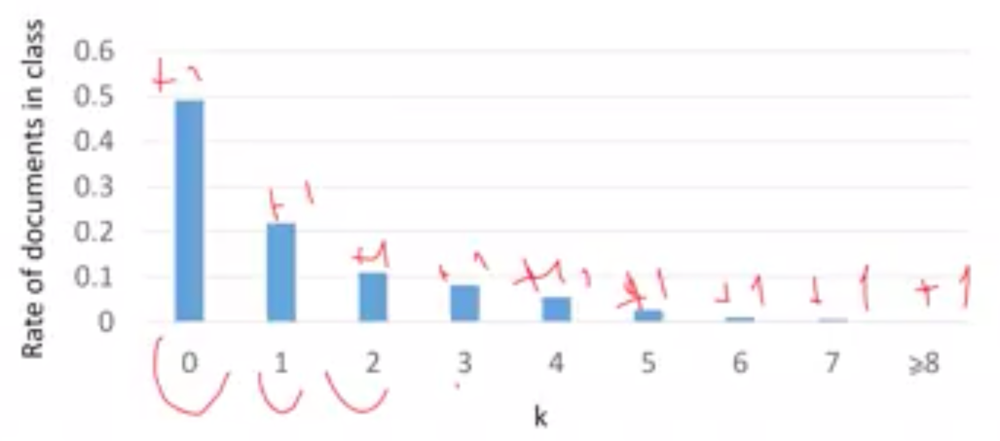

Распределение, где каждая фича принимает определенный ограниченный набор значений - **мультиномиальная**. Такой фичей как раз и является количество вхождений слова в документ. Общий подход для них такой же, как и в случае, описанном выше для слов в документе.

#### Бинарные фичи
По сути бинарные фичи - это частный случай мультиномиальных, но можем расписать формулу вероятности конкретно для них:

Часто это удобнее, чем ходить и проверять ифами фича принимает значение 1 или нет. Вероятность $P(x_i = 1 | y)$ рассчитываем так же со сглаживанием.

#### Численные фичи

Пытаемся приблизить распределением, теперь вместо обычных вероятностей - плотности вероятностей.

Часто приближаем плотностью нормального распределения.

$$p(x_i | y) = \frac{1}{\sqrt{2\pi \sigma^2_y}} e^{-\frac{(x_i - \mu_y)^2}{2 \sigma^2_y}} $$

$\sigma^2_y$ - выборочная дисперсия по классу, $\mu_y$ - выборочное средние по классу.
У нас может возникнуть проблема, если фича не распределена нормально, к примеру распределена как синий график с картинки, тогда приближение нормальным даст распределение, которое указано зеленым, что весьма ошибочно.

Для этого нужно подмешивать несколько нормальных распределений с помощью EM-алгоритмов.

[Момент в лекции](https://youtu.be/j1zFT3ep6O0?list=PLxMpIvWUjaJsttwLkYi-uEydy6R9Hk2-v&t=3129)

## Проблемы

1. Пусть есть метрическое пространство, считаем евклидово расстояние. Но по некорые фичи могут иметь слишком маленький разброс относительно других фич, поэтому почти не окажут влияние на расстояние. Хотим уметь масштабировать и нормализовывать данные.
2. Даны категориальные фичи, хотим уметь представлять их как числа, не создавая ложный порядок и расстояние

## One-hot-encoding

One-hot-encoding (OHE) используется для преобразования категориальных фич в числовой формат. Каждая уникальная категория превращается в отдельный бинарный столбец.

### Пример

| Цвет  | red | green | blue |
| ----- | --- | ----- | ---- |
| red   | 1   | 0     | 0    |
| green | 0   | 1     | 0    |
| blue  | 0   | 0     | 1    |

Таким образом между всеми точками получаем одинаковое расстояние, нет отношения порядка. Минус: увеличивает размерность данных.

## Scalers (масштабирование)

### MinMaxScaler

 **Формула**:  
  $x_{scaled}=\frac{x-min(x)}{max(x)-min(x)} * (max-min)+min$
  
- Приводит значения фич в диапазон $[min, max]$, обычно $[0, 1]$.
- $min(x),\ max(x)$ минимум\максимум в тренировочных данных. Они же берутся для валидационных и тестовых данных.
- Чувствителен к выбросам

### MaxAbsScaler

 Масштабирует фичи относительно их максимального абсолютного значения.

**Формула**:  
  $x_{scaled} = \frac{x}{\max(|x|)}$

- Сохраняет разреженность (sparsity) данных (нули это хорошо, например для матричных вычислений)

### StandardScaler

Переводит в нормальное распределение

**Формула**:  
    $x_{scaled} = \frac{x - mean(x)}{std(x)}$

- $mean(x)$ - среднее значние, $std(x)$ - стандартное отклонение
- Подходит для фич, распределённых близко к нормальному распределению.

### RobustScaler

 Устойчив к выбросам. Берёт среднюю часть точек и нормирует её. Расстояние до выбросов остаётся большим.

 **Формула**:  
  $x_{scaled} = \frac{x - median(x)}{percentile_{max}(x)-percentile_{min}(x)}$
  
  Обычно  
$x_{scaled} = \frac{x - median(x)}{percentile_{0.75}(x)-percentile_{0.25}(x)}$

# 5.2 SVM. Линейно неразделимая выборка. Модификация решения обратной задачи. Типы опорных векторов

[Момент в лекции](https://youtu.be/GpPDPrpIWy4?list=PLxMpIvWUjaJsttwLkYi-uEydy6R9Hk2-v&t=3294)

[ККТ в лекции](https://youtu.be/GpPDPrpIWy4?list=PLxMpIvWUjaJsttwLkYi-uEydy6R9Hk2-v&t=1974)

## 1. Линейно неразделимая выборка

Линейно неразделимые выборки возникают, когда невозможно провести гиперплоскость,
 разделяющую данные без ошибок. Для таких случаев вводится **мягкий предел** (*Soft Margin*), позволяющий некоторым точкам нарушать ограничения.

## Модификация задачи

**Формулы**:

- Было для линейно разделимой выборки:
  
$$
\left\lbrace \begin{array}{l}
    \frac{1}{2}w^Tw \rightarrow  \min \\
  y_i(w^Tx_i-b)\geq 1
\end{array} \right.
$$

- Cтало для неразделимой:

$$
\left\lbrace  \begin{array}{l}
    \frac{1}{2}w^Tw + C\sum^N_{i=1}\xi_i \rightarrow  \min \\
  y_i(w^Tx_i-b)\geq 1 - \xi_i \\
  \xi_i \geq 0
\end{array}\right.
$$

  $\xi_i$ — переменные ошибок, позволяющие некоторым объектам попадать в полосу или в другой класс
  
  $C$ — коэффициент, отвечает количество ошибок и ширину разделяющего пространства.

##  Двойственная задача

> ### Условия Каруша—Куна—Таккера
> 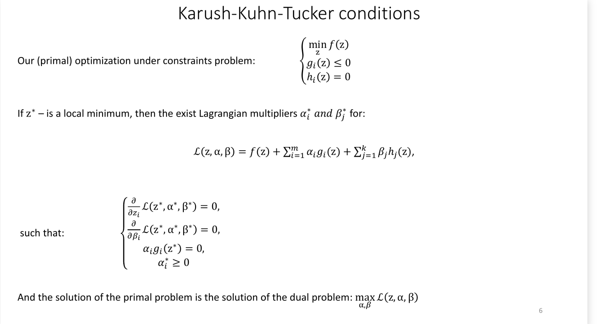

 

Дальше из ККТ подстановкой в $L$ получаем такую формулу и условия:
 

## Типы опорных векторов

У нас есть условия: 

$$
\left\lbrace  \begin{array}{l}
  w = \sum a_iy_ix_i\\
  y_i(w^Tx_i-b)\geq 1 - \xi_i \\
  a_i = C - r_i \\ 
  a_i(y_i(w^Tx_i-b)-1+\xi_i)=0 \\
  r_i\xi_i = 0
\end{array} \right.
$$

Из них следует три случая: 

1. **Внутренние векторы**:
   - $\alpha_i = 0$, $\xi_i = 0$, $y_i (w^T x_i - b) \geq 1$.
   - Эти точки не влияют на гиперплоскость, так как их множитель Лагранжа равен нулю, они находятся внутри границ.

2. **Хорошие опорные векторы**:
   - $0 < \alpha_i < C$, $\xi_i = 0$, $y_i (w^T x_i - b) = 1$.
   - Эти точки находятся на границе разделяющего пространства и определяют его.

3. **Плохие опорные векторы**:
   - $\alpha_i = C$, $\xi_i > 0$, $y_i (w^T x_i - b) \leq 1$.
   - Эти точки нарушают ограничение, находятся в неправильном классе или внутри разделяющей полосы.

##  Soft margin coefficient

 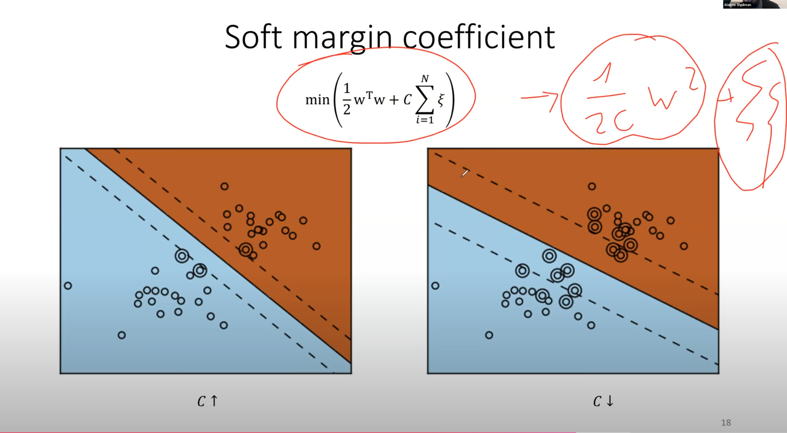

 7.1. WkNN. Треугольное и экспоненциальное ядро. Метод окна Парцена.

Смотри презентацию [ML_01_kNN_ROC.pdf](https://docs.yandex.ru/docs/view?url=ya-disk-public%3A%2F%2FTce3Hg4R521%2FAeGvN14%2FuhhBJbYmfaf3PaCuY7embqZnn%2BiIO%2BBq00rZ5aTL40zE%2Bb3nCKLCVTJ%2BSInaOUvvHQ%3D%3D%3A%2F%D0%9B%D0%B5%D0%BA%D1%86%D0%B8%D0%B8%2FML_01_kNN_ROC.pdf&name=ML_01_kNN_ROC.pdf) (Слайды 22-25) (Все презы [тут](https://disk.yandex.ru/d/wyPHyCSqv_4ilg/%D0%9B%D0%B5%D0%BA%D1%86%D0%B8%D0%B8)).

Смотри лекцию (за 2024-09-09): таймкод 01:17:30 [YouTube](https://youtu.be/AySw5WqkEKo?list=PLxMpIvWUjaJsttwLkYi-uEydy6R9Hk2-v&t=4650), [Google Drive](https://drive.google.com/drive/folders/1oAid_KeLC9P-_mvzrL-TT223MxnWHQB8).

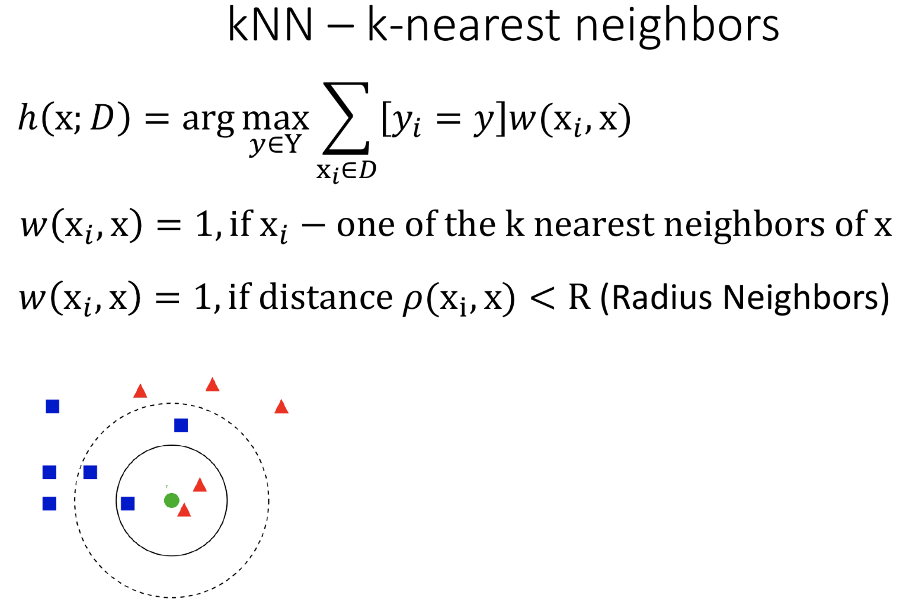

Основная проблема kNN в том, что мы не учитываем степень близости классифицированных точек к рассматриваемой (зеленой на картинке). Поэтому будем давать вес каждой точке, попавшей в рассматриваемый диапозон (радиус), относительно ее расстояния до рассматриваемой точки.

Для этого есть несколько методов:

#### Треугольное и экспоненциальное ядра

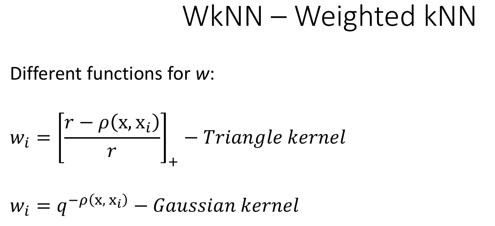

Для треугольного ядра, мы рассматриваем только положительные веса, в остальных случаях (тогда расстояние больше $r$ на картинке, мы ставим 0).

Графики:

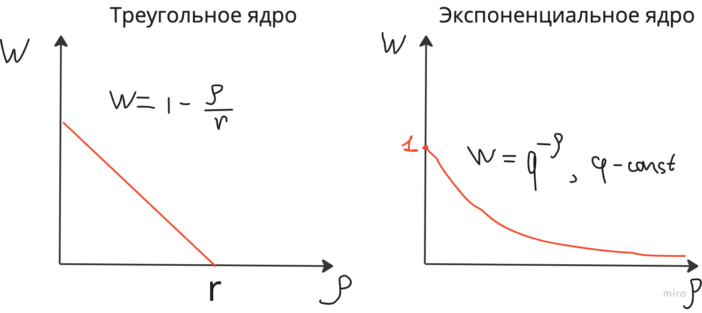

#### Метод окна Парцена

$K(z) = [1-z]_{+}$, где $z \in [0, 1]$

Небольшое пояснение про этот метод от ChatGPT (иными словами, этот метод - название алгоритма взвешенного учета K ближайших соседей):

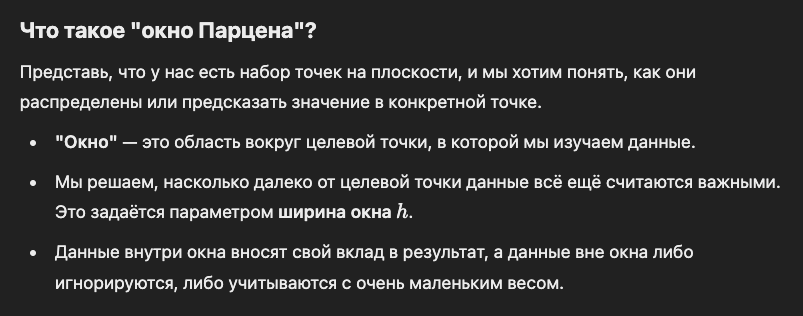

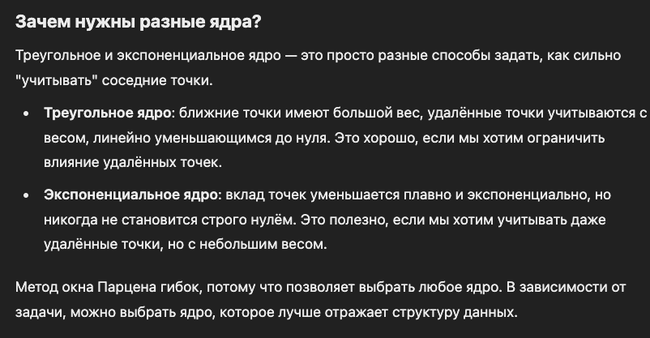

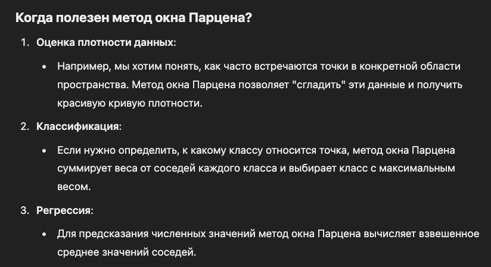

## 7.2. Ансамбли. AdaBoost.

Смотри лекцию 12 (2024-12-09): [YouTube (01:17:30)](https://youtu.be/bZFIfWzVvUs?list=PLxMpIvWUjaJsttwLkYi-uEydy6R9Hk2-v&t=4650) или [Google Drive (01:17:30)](https://drive.google.com/drive/folders/1oAid_KeLC9P-_mvzrL-TT223MxnWHQB8).

Смотри презентацию [ML_11_Ensembles.pdf](https://docs.yandex.ru/docs/view?url=ya-disk-public%3A%2F%2FTce3Hg4R521%2FAeGvN14%2FuhhBJbYmfaf3PaCuY7embqZnn%2BiIO%2BBq00rZ5aTL40zE%2Bb3nCKLCVTJ%2BSInaOUvvHQ%3D%3D%3A%2F%D0%9B%D0%B5%D0%BA%D1%86%D0%B8%D0%B8%2FML_11_Ensembles.pdf&name=ML_11_Ensembles.pdf) (слайды 1-11).

---

**Для данного билета имеет смысл читать "Билет 2" с прошлого года** [здесь](https://quixotic-block-dc0.notion.site/2022-e10e3970e09f403cb3671981d4ecfef8#9bb9502033e648dd9cc36da321c83388) (делай `CTRL+F` по _"Ансамбли. Soft and Hard Voting. Bagging. Случайный лес. AdaBoost"_).

На всякий случай прикладываю скрины Notion, если вдруг нет доступа:

---

Про экстремально случайные леса можно послушать по таймкоду 01:27:32 ([YouTube](https://youtu.be/bZFIfWzVvUs?list=PLxMpIvWUjaJsttwLkYi-uEydy6R9Hk2-v&t=5252)).

Их осмысленно использовать в случаях, когда вероятность переобучения для алгоритмического решения очень высока. Тогда лучше не использовать вообще ни какой алгоритм, а воспользоваться экстремально случайными лесами:

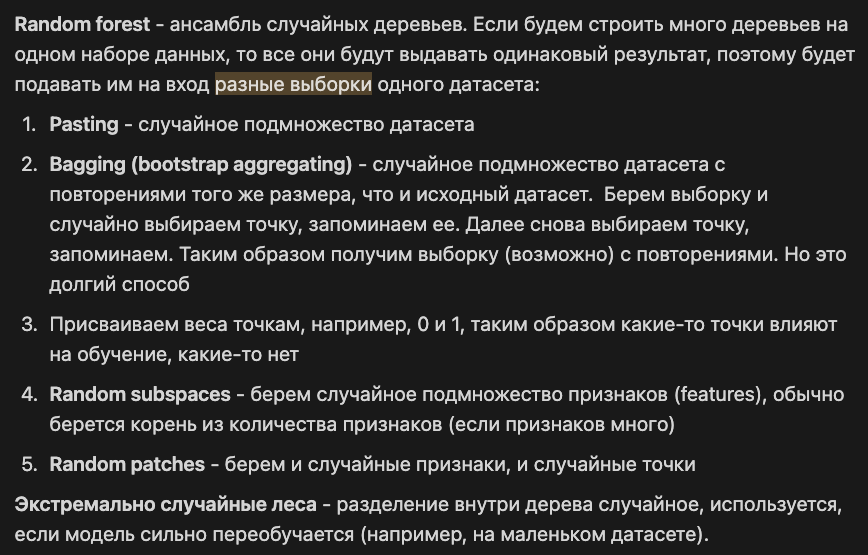

---

#### Далее про AdaBoost (Adaptive Boosting)

**В лекции смотри таймкод 01:28:53** ([YouTube](https://www.youtube.com/watch?v=bZFIfWzVvUs&list=PLxMpIvWUjaJsttwLkYi-uEydy6R9Hk2-v&index=12&ab_channel=UniversityProgramsITMO%2CHSE)).

Проблема при экстремально случайные лесах заключается в том, что каждое следующее дерево никак не зависит от предыдущего (следующее дерево никак не учитывает то, что получилось при построении всех предыдущих).

Из этого вытекает идея: **более полезно рисовать какое-то дерево (смотреть с каким точками оно разобралось хорошо), а следующее дерево создавать так, чтобы оно разбиралось с теми точками, с которыми у предыдущего не получилось**. Так мы с каждым следующим деревом немного улучшаем, или бустим, нашу классифицирующую функцию.

Полный слайд:

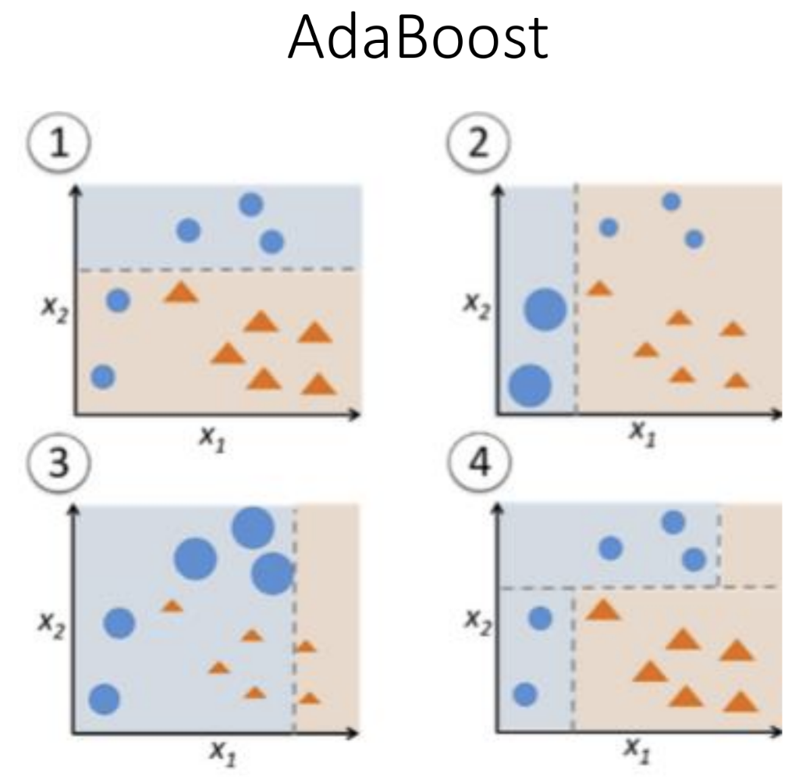

 8.1 Кластеризация. k-means, k-means ++, meanshift.

[Момент в лекции (где то 38 минута)](https://drive.google.com/file/d/1LqQXsL31swEIHreAZL7ebXBRsjO-HeyA/view?usp=drive_link)

## Clustering. Зачем мы это делаем?

- Получение новой информации: как устроено пространство точек, какие есть скопления
- Создание иерархии объектов: какие группы лежат рядом, какие подгруппы можно объединять
- Упрощение датасета: из миллиона точек сделать 100 кластеров
- Изучение аномалий: какие точки выделяются из общего множества
- Генерация дополнительных признаков: можно разбить точки на кластеры и вместо признаков, отвечающих пространственному положению, можно передавать кластер (с помощью one-hot encoding)

## kMeans: 
Определяет кластеры через центроиды.
Задаем искомое кол-во кластеров.  
Каждый кластер задается его центром.  
Для каждой точки находим ближайший центр и определяем точку этому кластеру.  
Пытаемся минимизировать сумму квадратов расстояний до ближайшего центра: 

**Алгоритм:**

- Выбираем случайные положения центроидов
- На каждой итерации находим точки для каждого кластера
- Центр кластера перемещаем в центр масс кластера (это средний вектор точек) - $\mu_i = \frac{1}{|C_i|}\sum_{x_j \in C_i}x_j$
- Повторяем все шаги, пока не будет устойчивости

*Плюсы*: простой и понятный

*Минусы*:

- нужно векторное пространство
- кластеры могут быть сложной формы и разных размеров
- нужно заранее задавать количество кластеров
- сильно зависит от кол-ва кластеров и от начального положения центроидов

## kMeans++:

**Алгоритм:**

- первый кластер выбираем случайно
- для всех остальных точек считаем расстояние $M(x)$ до выбранного центра
- следующую точку выбираем так, чтобы вероятность выбрать точку подальше была больше (то есть выбираем точку пропорционально $M^2$, где $M$ - расстояние до ближайшего центра). Чтобы это сделать, нанесем квадраты расстояний на отрезок и выберем случайную точку
- повторяем шаги 2-3 ровно $k-1$ раз (чтобы выбрать остальные центроиды)
- запускаем kMeans

## MeanShift:

Не задаем кол-во кластеров. У каждой точки есть ее масса, равная  $e^{-c||x-\mu||^2_2}$, где  $\mu$ – ближайший центр.   
MeanShift смещается в сторону наибольшей ближайшей плотности точек.

**Алгоритм:**

- каждую точку делаем кластером.
- итеративно рассматриваем точки, расстояние до которых > 0 и перемещаем кластер в центр масс соседей
- когда перемещение кластеров меньше $\epsilon$ останавливаемся и объединяем кластеры, которые на меньшем расстоянии, чем $\delta$

*Плюсы*: не нужно количество кластеров

*Минусы*: 
- нужно векторное пространство
- кластеры сложной формы и разных размеров 
- если пространство более разреженное (то есть нет таких плотных скоплений, как на картинке, то результат будет плохим)

## 8.2 Линейная регрессия, полиномиальная регрессия, гребневая регрессия.

[Момент в лекции (где то 28 минута)](https://drive.google.com/file/d/1O12ZzjAGaNAz4L-6_AKs7cWZxPX7D-yY/view?usp=drive_link)

## Линейная регрессия:  
Надо найти линейную функцию с минимальной ошибкой. Обычно функция ошибки – это мат ожидание квадрата разности.

$E_{out}$ - ошибка вне выборки

$E_{in}$ - ошибка внутри выборки

Функцией ошибки мы измеряем качество модели, а функцию потерь мы можем использовать для обучения,  
она используется в качестве замены функции ошибки для упрощения или когда мы не можем напрямую оптимизировать функцию ошибки.

Размерности X,Y:  

Чтобы минимизировать функцию потерь, найдем ее градиент и приравняем к нулю:  

Нашли аналитическое решение задачи регрессии - его можно найти, если матрица $X^TX$ обратима (то есть определитель не равен 0).

## Polynomial regression:  
Пытаемся приблизить полиномиальную функцию.

Идея: добавляем полиномиальных фичей

Но может случиться переобучение - когда модель будет подогнана под датасет, то есть высокий variance.  
Чтобы от этого избавиться, введем регуляризацию.

Мы можем найти опять точное решение $w = (X^TX + \alpha I)^{-1}X^Ty$.
Требуем, чтобы коэффициенты не были сильно большими.  

При добавлении такой регуляризации уменьшаем variance, но повышаем bias (но несильно).

  

На картинке изменение весов при разных коэффициентах регуляризации.

 
Когда вес колеблется между положительными и отрицательными значениям, то это плохо,  
так как  в какой-то момент начинаем переобучаться (например, есть признак - температура,  
и сначала он учитывается положительно, 
то есть имеет положительные веса, а затем отрицательно, получается, что просто подгоняем веса под нашу выборку)

 9.1 Кластеризация. DBSCAN. Agglomerative clustering, критерии объединения, органичение на связность

[Момент в лекции](https://youtu.be/mR3t3xN1J_I?si=apFFTRGotDSLSeRY&t=3610)

###  DBSCAN

####  Преимущества алгоритма

* Число кластеров, на которые нужно разделить, изначально не задано.

* Алгоритм позволяет выделять аномалии.

* Векторное пространство не требуется.

####  Недостатки алгоритма

* Необходимо подбирать $\epsilon, m$.

####  Алгоритм

Core samples (ядерные точки) - точки, которые содержат в своей $\epsilon$ окрестности хотя бы $m$ других точек.

1. Изначально каждая точка - отдельный кластер.

2. Вычисляем все core samples.

3. Объединяем core samples в один кластер, если они находятся в $\epsilon$ окрестности друг друга.

4.  Все точки, которые находятся в $\epsilon$ окрестности, также относим к соотвествующему кластеру. Остальные точки - аномалии. 

### Agglomerative clustering

Относится к алгоритмам иерархической кластеризации (множество алгоритмов кластеризации, направленных на создание иерархии вложенных разбиений исходного множества объектов). То есть в результате агломеративной кластеризации
получим множество разбиений на кластеры.

####  Преимущества алгоритма

1. Получаем множество разбиений на кластеры.

2. Есть способы избежать необходимости векторного пространства

#### Критерии объединения

1. maximum - максимальное расстояние между точками двух кластеров.

2. average - среднее расстояние между парой точкой, первая находится в первом кластере, вторая - во втором.

3. ward - дисперсия объединенного кластера. Представим, что объединили два кластера. Найдем центроид и посчитаем variance.

* $\sum (\mu - x)^2$, если есть векторное пространство

* $\sum_{i} \sum_{j} (x_i - x_j)^2$, если векторного пространства нет.

То есть алгомеративную кластеризацию можно использовать без векторного пространства.

#### Алгоритм

1. Каждая точка - отдельный кластер.

2. Находим 2 кластера, расстояние по заданному критерию между которыми минимально. Объединяем их.

3. Повторяем 2, пока не останется 1 кластер.

#### Ограничение на связность

Чтобы вместо такой ситуации:

получить такую (*связные компоненты*):

Добавим ограничение на связность - объединяем кластеры только, если минимальное расстояние между точками этих кластеров $\leq \epsilon$. В таком случае результатом агломеративной кластеризации может получиться не 1 кластер, если для оставшихся не выполняется ограничение на связность.

## 9.2 Нейронные сети. Функции активации. Функции выхода и ошибки для классификации и регрессии

[Момент в лекции](https://youtu.be/kzhP504D4v8?si=4O1d9XevNrVhSpt-&t=3376)

### Функции активации

Функции активации так называются, потому что активируем нейрон

Функции активации:

1. Sigmoid $\sigma(s) = \frac{1}{1 + e^{-s}} \in [0; 1]$

2. Tanh $\sigma(s) = \frac{e^s - s^{-s}}{e^s + e^{-s}} \in [-1; 1]$

3. ReLU $\sigma(s) = \max(0, s) \in [0; +\infty)$

Функции активации применяются на промежуточных слоях нейронной сети.

### Функции выхода и ошибки

|Задача|Функция выхода|Ошибка|
|------|--------------|------|
|Бинарная классификация|Сигмоид|NLLL|
|Регрессия|s|MSE|
|Мультиклассовая классификация|SoftMax|Cross Entropy|

### Пояснение для мультиклассовой классификации

Для мультиклассовой классификации нужна функция на выходе, чтобы преобразовать нейроны в вероятности классов. Например, первый нейрон в $P(y = 0 | x)$, второй $P(y = 1 | x)$ и так далее.

$x_j^L = \sigma^L(s_j^L) = \frac{e^{s_j^L}}{\sum e^{s_i^L}}$

$L(w) = -\sum o_i \cdot \log(x_i^L)$ - функция ошибки. $o$ - индикатор.

$$
o_i = \begin{cases}
1, y = i \\
0, иначе
\end{cases}
$$

Можно сделать хитрее: взять $\log$ от выходного вектора и умножить на вектор $o$ - one hot encoding. Такой NLLL называется Cross-Entropy.

 10.1 Регрессия. Bias-Variance

https://youtu.be/oJ_cnAQ3ViA?si=9ILpmQHiTv92DECV

Функция, получающаяся при обучении, зависит от датасета, на котором обучается.
Средняя "хорошесть" итоговой модели в смысле ее отклонения от истинной зависимости зависит от выбранного класса функций: от его гибкости, выразительности (линейная модель, дерево решений, SVM и т.п.)
Чтобы как-то описать эти зависимости существует теория Bias-Variance Decomposition
#### Средняя гипотеза

$$
\bar{h}(\mathbf{x}) = \mathbb{E}_D\big[h^D(\mathbf{x})\big]
$$
Это усредненный по всем возможным датасетам результат обучения

#### Декомпозиция ошибки

$$
E_{out}(h^D) = \mathbb{E}_X\Big[(h^D(\mathbf{x}) - f(\mathbf{x}))^2\Big]
$$
Ошибка на конкретном датасете

$$
\mathbb{E}_D\Big[E_{out}(h^D)\Big] = \mathbb{E}_D\Big[\mathbb{E}_X\Big[(h^D(\mathbf{x}) - f(\mathbf{x}))^2\Big]\Big] = \mathbb{E}_X\Big[\mathbb{E}_D\Big[(h^D(\mathbf{x}) - f(\mathbf{x}))^2\Big]\Big]
$$
Хотим посмотреть усредненную по всем датасетам ошибку. Распишем и переставим интегралы.

$$
\mathbb{E}_D\Big[(h^D(\mathbf{x}) - f(\mathbf{x}))^2\Big] = \mathbb{E}_D\Big[((h^D(\mathbf{x}) - \bar{h}(\mathbf{x})) + (\bar{h}(\mathbf{x}) - f(\mathbf{x})))^2\Big]
$$
Добавим и вычтем среднюю гипотезу, чтобы в итоге выразить что-то через нее.

$$
= \mathbb{E}_D\Big[(h^D(\mathbf{x}) - \bar{h}(\mathbf{x}))^2 + (\bar{h}(\mathbf{x}) - f(\mathbf{x}))^2 + \Big]
$$
$$
= \mathbb{E}_D\Big[(h^D(\mathbf{x}) - \bar{h}(\mathbf{x}))^2\Big] + \mathbb{E}_D\Big[(\bar{h}(\mathbf{x}) - f(\mathbf{x}))^2\Big] + \mathbb{E}_D\Big[2(h^D(\mathbf{x}) - \bar{h}(\mathbf{x}))(\bar{h}(\mathbf{x}) - f(\mathbf{x}))\Big]
$$
Второе слагаемое не зависит от датасета, а в последнем второй множитель тоже выносится, а оставшийся зануляется, что следует из определения средней гипотезы. Итого:
$$
= \mathbb{E}_D\Big[(h^D(\mathbf{x}) - \bar{h}(\mathbf{x}))^2\Big] + (\bar{h}(\mathbf{x}) - f(\mathbf{x}))^2
$$
Подставим получившееся обратно в нашу формулу:
$$
= \mathbb{E}_X\Big[\mathbb{E}_D\Big[(h^D(\mathbf{x}) - \bar{h}(\mathbf{x}))^2\Big] + (\bar{h}(\mathbf{x}) - f(\mathbf{x}))^2\Big]
$$
$$
= \mathbb{E}_X\Big[\mathbb{E}_D\Big[(h^D(\mathbf{x}) - \bar{h}(\mathbf{x}))^2\Big]\Big] + \mathbb{E}_X\Big[(\bar{h}(\mathbf{x}) - f(\mathbf{x}))^2\Big] = \text{variance + bias}
$$
Первое слагаемое называется **Variance** и показывает насколько мы в среднем отклоняемся от нашей средней гипотезы, то есть это отражает чувствительность итоговой функции к данным, на которых она обучается.

$$
variance = \mathbb{E}_X\Big[\mathbb{E}_D\Big[(h^D(\mathbf{x}) - \bar{h}(\mathbf{x}))^2\Big]\Big]
$$

Второе cлагаемое называется **Bias** и показывает нам в каком-то смысле лучшую ошибку, которая может получиться при использовании выбранного класса решений.
$$
bias = \mathbb{E}_X\Big[(\bar{h}(\mathbf{x}) - f(\mathbf{x}))^2\Big]
$$

По столбцам variance, по строкам bias

В идеальном случае у нас и то и то низкое.
Чаще нам приходится балансировать: если у модели низкий bias, то скорее всего она очень выразительная и средняя гипотеза очень хорошо находит истинную зависимость, но часто это означает, что модель из-за своей мощности легко переобучается, подстраивается под конкретный датасет. Так происходит, например, с решающими деревьями. 
- Низкий bias - модель в среднем хорошо находит истинную зависимость
- Высокий bias - модель слишком слабая и не может выразить истинную зависимость
- Низкий variance - модель слабо зависит от того, на каком датасете ее обучили и результат обучения легко прогнозируется.
- Высокий variance - модель сильно зависит от данных при обучении и результат сложно прогнозировать

При обучении $E_{in}$ (или $E_{train}$) это наша оценка на bias, т.к. это ошибка на подмножестве иксов.
А $(E_{val} - E_{train})$ - наша оценка на variance, т.к. она показывает, насколько наша ошибка зависит от датасета на обучении.

Иллюстрация Bias-Variance tradeoff

**Возможный вопрос: что хуже - высокий bias или высокий variance?**

Ответ: с высоким biasом ничего не сделать, а вот с высоким variance можно. Например, добавить регуляризацию или сделать ансамбль из нескольких моделей. Но про это в других билетах, кажется...

---

## 10.2 Векторные представления слов. CBOW, Skip-gram, Fasttext

https://youtu.be/wqkQ6qE7KIY?si=sSQsqEJdbvCo2tZQ&t=2333

#### Negative sampling
Какая проблема была у word2vec? Дорогой в вычислении знаменатель! Мы считаем экспоненту "размер словаря" раз:
$$
P(w_t | w_c) = \frac{\exp(f(w_t, w_c))}{\sum_{w_i \in Dict} \exp(f(w_i, w_c))}
$$
$$
\text{Loss function } J = \frac{1}{T} \sum J_t, \text{ where } J_t = -\log P(w_t | w_c) = -f(w_t, w_c) + \log\left( \sum_{w_i \in Dict} \exp(f(w_i, w_c)) \right)
$$
T - размер окна контекста.

Идея: поменяем $J_t$ и скажем, что мы хотим максимизировать вероятность нашего таргет-слова $f(w_t, w_c)$ и минимизировать вероятность для k случайных слов (то есть максимизировать 1-p, что и используется в формуле с сигмоидой), т.к. они вряд ли встречаются рядом с контекстным словом (из-за рандома там может оказаться и хорошее слово, но такое будет редко)

Теперь вместо $-\log{P(w_t | w_c)}$ считается новая $J_t$

$$
J_t = -\Big(\log \sigma(f(w_t, w_c)) + \sum_{j=1}^{k} \log \sigma(-f(w_j, w_c)) \Big)
$$

Негативные сэмплы сэмплируются из словаря по какому-то распределению (например, используется равномерное в степени 3/4)
#### Skip-gram

Skip-gram = word2vec + negative sampling

По слову контекста предсказываем вероятности таргет-слов jоптимизируя функцию из Negative sampling

#### CBOW (Continuous Bag Of Words)

Обратная к Skip-gram идея: берем таргет-слова и пытаемся по их сумме восстановить слово посередине. Из-за суммы взаимное расположение теряется, поэтому можно сказать, что мы смотрим на "мешок слов"
Здесь мы также используем Negative Sampling максимизируя вероятность пропущенного слова и минимизируя для рандомных. 

#### Fasttext

Идея: различных слов очень много и наша модель должна как-то обрабатывать слова, которые она никогда не видела при обучении + однокоренные слова должны быть похожи в своих представлениях. Давайте будем обучать вектора не только для целых слов, но и для их кусочков. Здесь мы добавляем < ... > в начало и конец, чтобы подчеркнуть роль  n-граммы в начале и в конце.
Теперь для каждого слова все вектора (включая вектор исходного слова, если оно есть) складываются и мы в любом случае получим какое-то представление для слова.
Ниже пример для 3-грам. (кстати необязательно все должны быть одной длины)

 11.1 Регрессия. Борьба с выбросами. Theil-Sen, RANSAC, Huber

https://youtu.be/8RM6OYFjW1g?si=DJzlz701ogSXIIbm&t=1168

Обычная линейная регрессия с MSE чувствительна к выбросам в данных. Что делать?
## Theil-Sen Regressor

Обучаем модель на подмножествах Х и берем медиану по результатам (геометрическую или покоординатную)

## RANSAC: RANdom SAmple Consensus

Обучаем модель на подмножествах Х и берем лучшую с точки зрения количества точек попадающих в полосу +-d около решающей прямой (inliers)
Обучаем финальную модель на этих inliers.
d - гиперпараметр

&nbsp;

## Huber Regressor

Идея: обычную регрессию "тянет" к выбросам, потому что ошибка на них большая и ее выгодно оптимизировать. Можно сделать функцию потерь, которая маленькие ошибки штрафует квадратично, а большие - линейно. 

Перед применением функции H отклонение дополнительно нормируется на $\sigma$, и потом умножается и складывается с ним для нормализации отклонений. 

$$
\min_{w, \sigma} \sum_{i=1}^{N} \left( \sigma + H_{\epsilon}\left(\frac{x_i w - y_i}{\sigma}\right)\sigma \right) + \alpha \|w\|_2^2
$$

$$
H_{\epsilon}(z) = \begin{cases}
 z^2, & \text{if } |z| < \epsilon \\
 2\epsilon|z| - \epsilon^2, & \text{if } |z| \geq \epsilon
\end{cases}
$$  
Здесь sigma - обучаемый параметр, а epsilon - гиперпараметр (типично выбирать 1.35)
Из-за усложнения функции обучение приходится делать градиентным спуском.

## Сравнение на разных данных

---

## 11.2 Трансформеры, общая архитектура. Attention, self-attention, positional-encoding

https://youtu.be/b0_gqNI-xm4?si=z-5QeusX0fTkp2Bs&t=1253

Идея внимания: для каждого слова можно определять важность остальных слов (на какие стоит обратить "внимание") и в соответствии с этой важностью формировать вектор выхода z, с которым дальше работаем. 
Улучшение трансформера в сравнении с LSTM/RNN в том, что там мы пытались в один или два вектора запихнуть всю информацию о предложении, из-за чего были потери информации.
Здесь мы заводим свой вектор контекста под КАЖДОЕ слово предложения.
К тому же подсчеты параллелятся

Блок Encoder будет заниматься кодированием нашего входного предложения, делая выжимку информации из него.
Архитектура Encoder блока сделана так, что его можно применить несколько раз, в теории увеличивая высокоуровневость представлений для слов.

Блок Decoder будет использовать информацию из Encoderа и авторегрессивно генерировать ответ как и в LSTM, то есть генерим по одному слову и присоединяем его на вход Decoderа, пока не сгенерируется токен конца предложения. 

https://youtu.be/b0_gqNI-xm4?si=LMsGZuAL2azfYvJc&t=1662
## Self-attention

После блока self-attention каждый $z_i$ хранит в себе выжимку предложения в контексте i-го слова.

Идея: для каждого слова будет вектор внимания, который говорит о связи нашего слова (it) со всеми остальными.

Self-attention потому что мы смотрим на слово из этого же предложения.

Rem: итоговый self-attention вектор является результатом softmax, откуда сумма равна единице и все значения положительны.

## Positional encoding
https://youtu.be/b0_gqNI-xm4?si=z1r03vKcb3qnM32U&t=2659
Когда мы считаем внимание, позиции наших слов не учитываются и получается "мешок слов". Чтобы избежать потерю пространственной информации придумали добавлять к основному эмбеддингу на вход еще и эмбеддинг позиции

Решение было найдено эмпирически.

## Attention в Decoder (возможно, лишнее)

Отличие от self-attention в энкодере в том, что self-attention в Decoder на самом деле маскированный на обучении, т.к. при обучении мы видим всю целевую последовательность, то есть можем считать attention для слов впереди, чего мы делать не хотим! В реальности, когда мы генерируем последовательность, никаких слов впереди у нас нет! Маска позволяет обнулить attention для слов впереди нашего слова, для которого мы считаем attention вектор. (перед softmax к ним добавляется -inf). Далее мы используем получившуюся матрицу в качестве матрицы Q для Encoder-Decoder Attention, а в качестве матриц K, V берем матрицу на выходе из энкодера. (K и V будут одинаковые)

&nbsp;

 12.1 Гипотезы и дихотомии. Функция роста и точка поломки. Доказательство полиномиальности функции роста в присутствии точки поломки.

[лекция](https://youtu.be/8RM6OYFjW1g?si=5XATXK00sW-9epKO&t=2469)

Теория ошибки

$E_{in}(h) = \frac{1}{N}\sum_{i = 1}^{N}e(h(x_n), f(x_n))$ - ошибка внутри выборки. e = 0 или 1 тк ошибка классификации\
$E_{out}(h) = E_x(e(h(x_n), f(x_n))$ - обычно не знаем, x - любой, не только из датасета

Неравенство Хефтинга \
$P(|E_{in}(h) - E_{out}(h)| > \epsilon) \leq M2e^{-\epsilon^2N}$\
где $|E_{in}(h) - E_{out}(h)|$ - ошибка обобщения
M - количество гипотез

При достаточно большом N, мы можем гарантировать хороший результат те хорошее обобщение\
Но неравенство хорошее только если у нас одна гипотеза. Если мы начинаем их перебирать в процессе обучения, то все гарантии пропадают

**Гипотеза** - функция $h: X \rightarrow Y$. Мы хотим её приблизить к f

Если $h1 \approx h2$ то и $|E_{in}(h1) - E_{out}(h1)| \approx |E_{in}(h2) - E_{out}(h2)|$\
Поэтому мы будем рассматривать дихотомию

**Дихотомия** - множество гипотез, которые различаются между собой на нашем датасете\
$h: {X_1,..X_N} → {-1, +1}$. Их $\leq 2^N$

**Функция роста** Максимальное количество дихотомий на N точках при классе гипотез H\
$m_H(N) = max_{x_1..x_N} |H(X_1,..X_N)| \leq 2^N$

**Точка поломки** Минимальное число точек, на котором $2^k$ не достигается\
$min(k : m_H(k) < 2^k)$

Неравенство Вапника-Червоненко (VS Inequality)\
$P(|E_{in}(h) - E_{out}(h)| > \epsilon) \leq m_H(2N)\cdot 4e^{-\epsilon^{1/8} N}$

Если $m_H$ - экспоненциальная, то у нас нет никаких гарантий. Но если полиномиальная то она есть

### Теорема
#### Если есть точка поломки, то функция роста - полиномиальная

Доказательство\
Переходим к представлению в виде бинарных строк. У нас теперь есть строка из +-1 длины N. Таких строк у нас B(N, k), 
оно соответствует числу уникальных гипотез те строки не могут повторяться. k - это такое минимальное значение, что
какие бы k столбцов мы не взяли, мы не покроем все $2^k$ вариантов

$B(N, k) = m_H(N)$ с точкой поломки k. Представим в виде 
$B(N, k) = \alpha + 2\beta$
Смотрим на последний элемент строки и на часть $(x_1, .. x_{N - 1})$. Если от встретился два раза (те с разным последним элементом),
то относим в группу $\beta$ иначе в $\alpha$

$\alpha + \beta \leq B(N - 1, k)$ тк соответствуют уникальным строкам
$\beta \leq B(N - 1, k - 1)$ все строки уникальные. Пусть там не k-1, а k. \
Тогда существует k - 1 столбец, которые покрывают все возможные $2^{k - 1}$ вариант. Добавим вторую $\beta$ группу и 
последний столбец тк он обязательно разный для $\beta$, то мы получим k столбцов, которые покрывают $2^k$ вариантов. 
А мы изначально считаем, что это не так 

Получили выражение\
$B(N, k) \leq B(N - 1, k) + B(N - 1, k - 1)$

Мат. Индукция, что 
$B(N, k) \leq \sum_{i = 0}^{k - 1} \binom{N}{i}$

База. $B(N, 1) = 1$, $B(1, k > 1) = 2$\
ИП. $B(N, k) \leq B(N - 1, k) + B(N - 1, k - 1) \leq \sum_{i = 0}^{k - 1} \binom{N - 1}{i} + \sum_{i = 0}^{k - 2} \binom{N - 1}{i} =$\
$= 1 + \sum_{i = 1}^{k - 1} \binom{N - 1}{i} + \sum_{i = 1}^{k - 1} \binom{N - 1}{i - 1} = \sum_{i = 0}^{k - 1} \binom{N}{i}$

Объяснения полиноминальности нам не дали, но если на пальцах, то k - зависит от группы гипотез H, а не от N

## 12.2 Сверточные нейронные сети. Свертки, max pooling, padding. Трансферное обучение.

[лекция](https://youtu.be/jTKUzredMhA?si=7VkPJpPnZg6_npwS&t=1441)

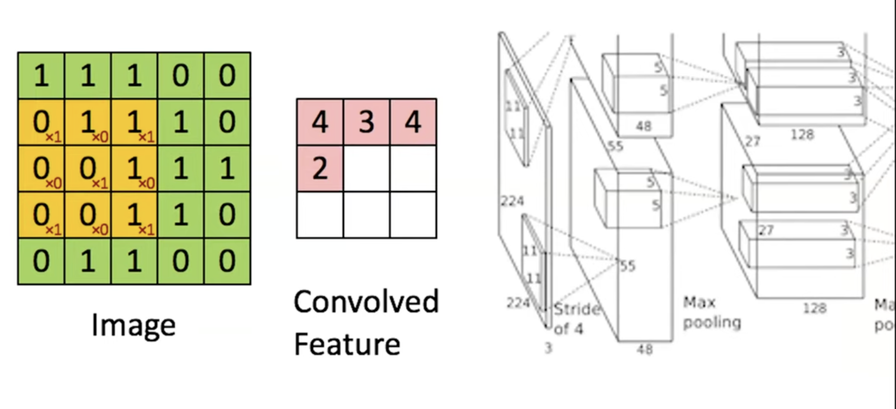
Пробегаемся ядром по изначальной картинке. Причем в ядре мы можем выделять диагональные линии (как в примере), горизонтальные и тд\
Поэтому после первого шага мы получаем матрицу размерности 3 тк это целый набор сжатых данных. Поэтому дальше мы будем накладывать маску-куб .
Размерность толщины также будет расти если мы используем несколько каналов для передачи цвета

Параметры свертки: 
* kernel - ядро: 3x3 и обычно не пишут 3x3xТолщина прошлого слоя - размер накладываемой маски
* stride - шаг свертки - сдвиг ядра по осям - отвечает за размер линейного сжатия

### Pooling
Способ сжатия сетки с сохранением сигнала. Мы из каждой области берем max или average

Пример, kernel 2x2, stride 2

### Padding
Борьба с обрезанными краями. Увеличиваем картинку по краям. Если kernel был размера mxn, то добавочка будет толщиной
m / 2 и n / 2 соответственно (с округлением вниз), так чтобы центр свертки попадал в угол.

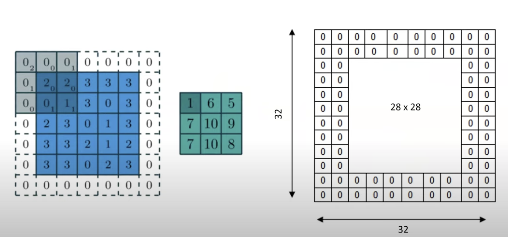

### Transfer learning

Берем хорошую готовую чужую сетку, отрезаем от нее кусок и вставляем свою маленькую специально нашу. 
Обучаем только этот наш кусочек. И получается неплохо. Важно, что наш learning rate должен быть значительно ниже

### Ликбез в историю
* LeNet - одна из первых сеток с глубоким обучением
* IMGNET - 1000 классов данных 1.2 млн картинок размеченных по категориям
* AlexNet - масштабирует все картинки до 256x256. Оттуда берет рандомный кусок 224ч224 и зеркалит его, расширяет датасет
* VGGNet - доказали, что никакая сверка кроме 3x3 не нужна. Она может из заменить, не хуже и легче. \
Свертка 7x7 - это свертка 3x3 повторенная 3 раза, но число операции 49 или 27
* Google сделал сетку с несколькими выходами
* Microsoft сделал Residual. Суть, а вдруг мы в процессе что-то теряем? давайте иногда изначальную штуку подтягивать. 
Теперь свертка это не просто F(X), а F(X) + X 

Свертка 1x1 это на самом деле свертка 1x1xТолщина поэтому ее используют для уменьшения глубины или замены цветовых каналов

 Предисловие

1. Смотри презентацию 4: [ML_04_VC_Dimension.pdf](https://docs.yandex.ru/docs/view?url=ya-disk-public%3A%2F%2FTce3Hg4R521%2FAeGvN14%2FuhhBJbYmfaf3PaCuY7embqZnn%2BiIO%2BBq00rZ5aTL40zE%2Bb3nCKLCVTJ%2BSInaOUvvHQ%3D%3D%3A%2F%D0%9B%D0%B5%D0%BA%D1%86%D0%B8%D0%B8%2FML_04_VC_Dimension.pdf&name=ML_04_VC_Dimension.pdf).
1. Смотри лекцию 6: [YouTube (01:11:45)](https://youtu.be/8RM6OYFjW1g?list=PLxMpIvWUjaJsttwLkYi-uEydy6R9Hk2-v&t=4305) (начало с 31:20; данная тема с 01:11:45).

**О чем тут речь:**

1. Что такое Perceptron.
1. Нер-во Вапника-Червоненкиса.
1. Точки поломки и дихотемии.

Данный билет связан с 12.1, так как использует некоторые его определения. Можно глянуть по диагонали. Снизу приведен контекст, необходимый для части 13.1.

### Perceptron (Перцептрон)

Это первая нейронная созданная сетка. Она решает задачу **линейной классификации множества точек**. Т.е., дано пространство с точками из **двух классов**, и нам нужно провести прямую (гиперплоскость) так, чтобы разбить это пространство на 2 кластера в соответствии с классами.

#### Как определить принадлежность точки к классу

Перцептрон - это наша гиперплоскость. Тогда построим к ней нормаль и проведем проекцию от рассматриваемой точки до этой нормали. Если координата спроецированной точки больше координаты точки, полученной при проекции перцептрона, то один класс; иначе - второй.

Как решается задача нахождения весов для перцептрона:

Т.е. $h(x)$ по $x$ определяет его принадлежность к классу $+1$ или $-1$. **Важно, что мы дописали свое слагаемое-свободный член в виде $w_0 x_0$**.

### Perceptron training

См. лекцию [34:26](https://youtu.be/8RM6OYFjW1g?list=PLxMpIvWUjaJsttwLkYi-uEydy6R9Hk2-v&t=2066) или [слайд 3](https://docs.yandex.ru/docs/view?url=ya-disk-public%3A%2F%2FTce3Hg4R521%2FAeGvN14%2FuhhBJbYmfaf3PaCuY7embqZnn%2BiIO%2BBq00rZ5aTL40zE%2Bb3nCKLCVTJ%2BSInaOUvvHQ%3D%3D%3A%2F%D0%9B%D0%B5%D0%BA%D1%86%D0%B8%D0%B8%2FML_04_VC_Dimension.pdf&name=ML_04_VC_Dimension.pdf).

Pocket algorithm и Feature engineering там же.

### Theory of error

Определения:

1. $E_{in}(h)$ - это ошибка внутри выборки $X$, которое равно среднему по ошибке в точке. Т.е. доля примеров, на которых мы с нашей гипотезой $h$ ошиблись.

1. Ошибка в точке $e(h(x_n), f(x_n))$ равна либо $0$ (если наша гипотеза $h$ правильно классифицирована $x_n$), либо $1$, если неправильно.

1. $E_{out}(h)$ - матожидание ошибки по $x$ (его мы не знаем).

### Hoeffding's inequality

Данное нер-во описывает как хорошо у нас $E_{in}(h)$ приблизит $E_{out}(h)$.

Если много гипотез подставлять в неравенство, то мы должны умножать то, что справа, на $M$ - кол-во гипотез, которое мы перепробовали:

Мы вводим понятие дехотемии:

Дехотемия - это почти как гипотеза $h$, но она определена только на множестве $x_i$ из датасета, а не на всем пространстве $X$. Это надо, чтобы $M$ в нер-ве выше ограничить.

**$m_{H}(N)$ = max кол-во дихотемий на $N$ точках при классе гипотез $H$.**

Далее определяем **точку поломки** (**breakpoint**), как минимальное кол-во точке $x_i$, для которых (при их хитром расположении) нельзя построить дихотемию, которая бы правильно их определяла по их классам $y_i$:

Зная $m_H(N)$ от _Hoeffding's inequality_ мы переходим к _Vapnik–Chervonenkis Inequality (VC inequality)_:

Далее мы показывали, что $M_H(N)$ полиномиально зависит от $N$, что дает хорошую оценку в нер-ве при больших $N$.

_Теперь у нас есть вся база для части 13.1_.

---

## 13.1 Размерность Вапника-Червоненкиса. VC-размерность для перцептрона, доказательство.

**Def**: Размерность Вапника-Червоненкиса (_VC-dimention_) $d_{VC}(H)$ для гипотез типа $H$ — это максимальное $N$ такое, что $m_H(N) = 2^N$.

При этом, есть явная формула для $d_VC(H)$ (за 1 шаг до точки поломки):

$$ d_{VC}(H) = k - 1 $$

Где $k$ - это _точка поломки_.

### Подсчет размерности Вапника-Червоненкиса для перцептрона

Пусть $d$ - размерность рассматриваемого пространства. Тогда размерность Вапника-Червоненкиса для перцептрона равна:

$$ d_{VC} = d+1 $$

**Док-во:**

См. лекцию на [01:13:21](https://youtu.be/8RM6OYFjW1g?list=PLxMpIvWUjaJsttwLkYi-uEydy6R9Hk2-v&t=4401).

Чтобы это доказать, нужно показать 2 свойства:

1. **(1): Доказать, что $d+2$ - это точка поломки**.
1. **(2): Доказать, что для $d+1$ все возможные _дихотамии_ получаются (их всего $2^{d+1}$)**.

**Док-во для (2):**

Напомним, что размерность перцептрона (т.е. его весов) равна $d$. Построим матрицу размера $d+1$ x $d+1$, где первый столбец - $x_0$, который есть добавочный член в веса перцептрона (см. лекцию 6 [31:28](https://youtu.be/8RM6OYFjW1g?list=PLxMpIvWUjaJsttwLkYi-uEydy6R9Hk2-v&t=1888), минуты 3-4):

Теперь мы хотим, чтобы наш перцептрон правильно классифицировал заданные точки (т.е. надо $w$ правильно подобрать). Мы это определяли, как равенство знака. Тогда решим такое уравнение:

$$y \in \{1, -1\}$$

$$ sign(Xw) = y $$

Усложним себе задачу и положим не равенство знака классу точки (т.е. $y$), а просто равенство:

$$ Xw = y $$

Так как $X$ мы определили как матрицу выше, и данная матрица обратима (т.к. нижнетреугольная), то $w$ явно выражается:

$$ w = X^{-1} y $$

Так мы построили решение (т.е. нахождение $w$) для любого переданной дихотемии $y$ в пространстве размера $d+1$.

**Док-во для (1):**

Отвечаем на вопрос, почему нельзя получить все возможные дихотемии на $d+2$ точках.

При такой размерности мы получаем матрицу размера $(d+1)$ x $(d+2)$:

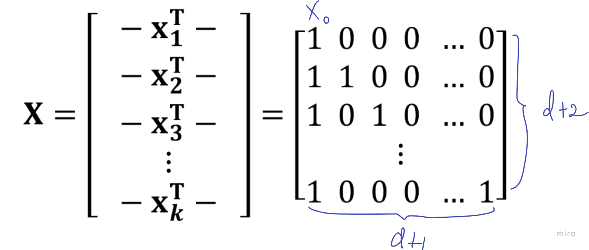

Тогда в этой матрице есть линейная зависимость:

$$ x_j = \sum_{i!=j} x_i a_i $$

Сейчас мы явно построим пример, на котором мы не сможем решить уравнение со знаком выше ($sign(Xw)=y$).

Домножим на $w^T$:

$$ w^T x_j = \sum_{i!=j} w^T x_i a_i  \ \ (*) $$

Теперь сконструируем дихотемию, которая не получится ни при каком $w$:

Положим $y_i := sign(a_i)$ и $y_j := -1$.

Предположим, что мы нашли такой $w$, что он решает уравнение **(*)**, тогда:

$$ sign(Xw) = y \implies sign(w^T x_i) = y_i = a_i $$

Получаем, что $w^T x_i$ и $a_i$ одного знака, тогда наша сумма в **(*)** всегда положительна. При этом, $w^T x_j = y_j = -1 \implies$ левая сторона всегда отрицательна $\implies$ противоречие с тем, что $w$ - решение.

Получаем, что заданный $y$ - это дихотемия, которая не получается никаким $w$ $\implies$ $d+2$ - это точка поломки.

## 13.2 Глобальный поиск. Случайный поиск, grid search, случайное блуждание.

Смотри презентацию [ML_12_Bayes_and_DFO.pdf](https://docs.yandex.ru/docs/view?url=ya-disk-public%3A%2F%2FTce3Hg4R521%2FAeGvN14%2FuhhBJbYmfaf3PaCuY7embqZnn%2BiIO%2BBq00rZ5aTL40zE%2Bb3nCKLCVTJ%2BSInaOUvvHQ%3D%3D%3A%2F%D0%9B%D0%B5%D0%BA%D1%86%D0%B8%D0%B8%2FML_12_Bayes_and_DFO.pdf&name=ML_12_Bayes_and_DFO.pdf&nosw=1) (слайды 22-24)

Смотри [лекцию 13](https://drive.google.com/drive/folders/10gvaRHs_NQW4v5ULc5b6L83-pPs2zq6g) (с 59:00 по 01:04:06).

Задача: научиться минимизировать/максимизировать функцию неградиентным способом. Рассматриваем 3 способа:

### Случайный поиск

Случайно кинули точки, посмотрели значение функции и выбрали минимум:

### Grid search

Кидаем точки по сетке не случайно, а по сетке. Не для всех задача такой способ минимизации подходит. Например, в задаче про коммивояжёра мы имеем пространство перестановок, на котором с данным способом минимум не найти.

### Cлучайное блуждание

Случайно выбираем направление (чаще фиксированного) шага с текущей позиции и обновляем эту самую позицию.

 14.1) Нейронные сети. Перцептрон. Логистическая регрессия и градиентный спуск.

Лекция: https://www.youtube.com/watch?v=kzhP504D4v8&list=PLxMpIvWUjaJsttwLkYi-uEydy6R9Hk2-v&index=7

Первая нейронная сеть - перцептрон. По сути модель для бинарной классификации. Функция активации - 
$f(x) = 1 \,\,\,\text{если}\,\,\, x > treshhold, -1\,\,\text{иначе}$

Сдвигаем прямую на $y_i||X_i||^2$.

1. Фичи – входные данные
3. Считаем $\sum w_ix_i$
4. Функция трешхолда (sign) – функция активации

Можно добавить много слоев перцептрона
Проблема: такие сети ограничены, хотим что-то умнее. Решение: возьмем другую функцию активации, заменим выходную функцию перцептрона на сигмоиду:$\\$

Понятно, как получить результат. Вероятность попасть в конкретный класс считается так:

Получаем логистическую регрессию (на самом деле решаем задачу классификации, функция нам дает чиселко - а мы по этой чиселке решаем, принадлежит ли точка классу или нет).

Раньше наш лосс - количество неправильно классифицированных точек. Теперь в непрерывном случае удобно рассматривать функцию правдоподобия (логарифм совместной плотности [negative log likely loss]):

Как обучать сеть - градиентный спуск по лоссу логистической регрессии
Хотим на каждом слое минимизировать функцию лосса. На $i$-м слое считаем градиент по нашим весам $w_i$. Спускаемся в обратном направлении градиента с шагом $\eta$.

Есть стохастический градиентный спуск - делим данные на батчи, в пределах одной эпохи считаем градиенты по очередному батчу и спускаемся. Повторяем, пока батчи не закончились.
Веса модели обновляем с помощью back propagation (обратное распространение ошибки) - идем сконца, считаем градиенты и фиксим веса. 

## 14.2) ЕМ-алгоритм.

Алгоритм, который пытается оценить, каким генератором получены точки.

Пусть у нас есть набор точек $x_i$, который сгенерирован смесью Гауссиана, которая определена вектором средний $\mu_k$ и матрицей ковариации $\sum_k$ (то же самое, что и среднее и дисперсия, только для векторов). Для каждого гауссиана есть вес $\alpha_k$ - вероятность, что случайная точка сгенерирована гауссианом $k$ (пусть есть сгенерированный набор точек, и мы пытаемся определить, какой процесс сгенерировал эти точки). 

Мы считаем, что процесс сгенерирован так: для каждого класса строим вектор распределений, у каждого распределения есть вес. На первом шаге мы смотрим на мат ожидание того, что датасет сгенерировали конкретным гауссианом, а затем меняем гауссианы так, чтобы это мат ожидание достигалось максимальным вероятным образом. То есть считаем подходящесть (affinity) точек распределению (**E-step**) и в зависимости от него сдвигаем параметры (веса, среднее в центр масс и дисперсию) (**M-step**).

$p(\mu_k, \sum_k|x_i)$ - точка $x_i$ была сгенерирована $k$-м гауссианом, дальше идет формула полной вероятности.

Алгоритм:
Для каждого класса заводим параметры:

Каждому распределению сопоставляем вес (alpha_k) – вероятность, что случайная точка в датасете сгенерирована этим распределением (сумма этих весов – 1)
E-step: считаем близость (affinity) точки к распределению – вероятность, что случайная точка в датасете сгенерирована конкретным распределением k (они отличаются от alpha тем, что датасет у нас конкретный и точка конкретная)

Сумма этих близостей равна – 1.
M-step: сдвигаем параметры так, чтоб большая часть точек генерилась таким распределением:

Повторяем

 15.1) Нейронные сети. Регуляризация, weight decay, ранняя остановка, dropout, аугментация данных.

Лекция: https://www.youtube.com/watch?v=kzhP504D4v8&list=PLxMpIvWUjaJsttwLkYi-uEydy6R9Hk2-v&index=7

Регуляризация - способ контролировать норму весов. Если веса стали громадными, скорее всего мы переобучились на тренировочном датасете и некоторые признаки стали весить необьятно много. Способов её несколько:

1. Увядание весов (L2-регуляризация):

Так же, как и в линейной регрессии, добавляем в качестве слагаемого норму весов. Тогда придется делать компромисс между минимизацией лоссом и неразжирением весов.

Справа - градиент новой функции лосса. Тогда шаг спуска выглядит как $w - \eta(\frac{dL}{dw}) - \frac{\lambda}{N}w$. Добавили коэффициент для того, чтобы идти в сторону уменьшения весов. 

2. Ранняя остановка:

Останавливаемся в тот момент, когда ошибка на валидационном датасете начинает расти.
Используем валидационную выборку для подбора гиперпараметров.

3. Аугментация

Способ борьбы с переобучением из-за маленького датасета. Из датасета пробуем сделать больше данных, чем он есть. Пример с картинкой: вырезать, добавить шум, перевернуть.

4. Dropout

Выключаем некоторые нейроны во время обучения. Но надо домножить сигналы на каждом уровне на $\frac{N}{n}$, n - число включенных нейронов на уровне, N - все, чтобы сумма сигналов осталась прежней. 

## 15.2) Ансамбли. Градиентный бустинг решающих деревьев. XGBoost.

Оставь надежду всяк сюда входящий.

Лекция: https://www.youtube.com/watch?v=bZFIfWzVvUs&list=PLxMpIvWUjaJsttwLkYi-uEydy6R9Hk2-v&index=12

старый конспект: https://quixotic-block-dc0.notion.site/2022-e10e3970e09f403cb3671981d4ecfef8#9bb9502033e648dd9cc36da321c83388

 16.1 Реккурентные нейронные сети. LSTM.

[Ссылка на билет (YouTube)](https://youtu.be/wqkQ6qE7KIY?si=yBbXTGs9iFeCL7Q-&t=3611) - с тайм кодом.

### Мотивация
После появления представлений для слов в виде векторов (word2vec, CBOW, skip-gram, etc.) хотим уметь решать различные задачи через нейронные сети. Например, предложим общую схему, как можно реализовать автоматический перевод предложений. У нас есть две части: кодировщик и декодировщик.

- Кодировщик:
    - На каждом шаге принимает очередное слово $x_i$ и собранный для $i$-ого префикса контекст $h_i$.
    - Эти две величины конкатенируются и прогоняются через сетку $W$, в итоге получаем какой-то вектор, который мы добавляем к $h_i$ и получаем $h_{i+1}$ - новый вектор, кодирующий префикс, включающий слово $x_i$ и так далее.
- Декодеровщик:
    - На $i$-ом шаге получает на остаток вектора предложения и декодированное слово с прошлого шага $y_{i}$.
    - Декодирует и получает очередное слово $y_{i+1}$, передает его дальше и остаток предложения (что такое этот остаток пока неясно).

*Note*: индексы для $h_i$ и $y_i$ сдвинуты относительно $x_i$, чтобы соответствовать картинке.

### Общая схема Recurrent Neural Network

В общем случае RNN у нас есть три различные нейронки, определяющие параметры "клеток", которые многократно повторяются:
- $W_{\rightarrow}$: переход из прошлой клетки в следующую, то есть прогон состояния $t-1$ клетки для получения на вход $t$-ой.
- $W_{\uparrow}$: предобработка очередного инпута $x_t$ перед передачей в $t$-ую клетку.
- $W$: нейронка, выдющая по $H_t$ (состоянию текущей клетки) аутпута $y_t$.

То есть при обучении такой нейронки во время обратного распространения градиента у нас матрица $W_{\rightarrow}$ будет участвовать во всех вычислениях, что может привести к следующим проблемам:
- **Взрыв градиента**: решить можно клиппингом градиента, то есть мы просто ставим ограничинваем градиент какой-то константой.
- **Затухание градиента**: числа в состоянии очередной клетке становятся маленькими, слово $x_i$ на этом шаге начинает слабо влиять на смысл предложения, из-за чего мы можем не учесть реальное влияние этого слова на предложения. **Чтобы с этим бороться существуют LSTM**.

### LSTM (long short-term memory)

Органзация клетки в нейронках с LSTM пользуется концепцией гейтов - это сигмоиды, которые используются для домножения входных/выходных векторов клетки для обеспечениях различных свойств.

На пальцах:
- **Forget gate**: пытается понять, что нам нужно забыть из состояния предыдущей клетки.
- **Input gate**: что нам нужно добавить в состояние текущей клетки перед его передачей в следующую.
- **Output gate**: что нам нужно для генерации аутпута текущей клетки.

Как пересчитывают значения в новой клетке:
- Текущее состояние ($C_t$):
    - Из forget gate мы из сконкатенированных $y_{t-1}$ и $x_t$ путем прогона через нейронку $W_f$ и взятие сигмоиды определяем ту информацию, которую нужно забыть из предыдущего состояния клетки (домножение $C_{t-1} \cdot f_t$).
    - Какую информацию от сконкатенированных $y_{t-1}$ и $x_t$ и прогоненных через нейронку соответствующие нейронки и функции нужно добавить/отнять к вектору состояния клетки.
- Аутпут ($y_t$):
    - Из состояния клетки $C_t$, пропущенного через $\tanh$, определяет что из сконкатенированных $y_{t-1}$ и $x_t$ должно войти в аутпут текущей клетки.

Почему это работает и не позволяет затухать градиенту никто не знает...

### Доп. вопросы по этому билету
- Для чего нужен $\tanh$ в input gate для LSTM (для того, чтобы к текущему состоянию клетки уметь прибалять и отнимать, т.к. значения $\tanh$ лежат в $[-1, 1]$).
- Как гугл сделал машинный перевод на LSTM (Google Neural Machine Translation):
    

## 16.2 Решающие деревья. Регуляризация и ускорение решающих деревьев.

[Ссылка на билет (YouTube)](https://youtu.be/bZFIfWzVvUs?si=In8gCFgmYVUvvZDe&t=824) - с тайм кодом.

### Решающие деревья

- Есть ноды дерева, в каждой у нас есть распределение классов (число векторов из датасета каждого класса). У нас есть набор фичей и мы хотим делить по распределению классов выбрав некоторый threashold для какой-то фичи.

- Доделившись до листа, определяем все попавшие в будущем элементы в этот лист как класс с наибольшим числом векторов из датасета. 

- Если нода имеет только один класс, то она называется **чистой**.

#### Как делиться в ноде
- Перебираем фичу, по которой хотим поделиться, и все threashold'ы
- Выбираем то разбиение, которое максимизирует метрику Information Gain:
    
- $I(X_{...})$: это метрика Impurity, она может по-разному задаваться:
    - **Misclassification error**: при выборе в качестве ответа класс с максимальным число попавших точек это будет $(1 - \text{доля этого класса от размера ноды})$.

        
    
    - **Entropy**: выделить чистую ноду лучше, чем возиться с разюиением, поэтому может приоретизить такие разбиения
        
    
    - **Gini**: считать лоuарифм для все фич и всех threashold долго, поэтому есть такой вариант (смысл: вероятность ошибиться, если мы будет назначать класс, пропорциональное вероятности этого класса в ноде)
        

#### Применение

CART (Classification and regression trees)
- Для классификации выдаем номер класса, где максимальное число элементов
- Для регрессии выдаем среднее элементов в листе

### Регуляризация

1. Ограничение глубины дерева
    
2. Ограничиваем минимальное число точек в листе (чтобы они не были слишком маленькие)
3. Pruning
    - **Minimal error pruning**: делим выборку на тестовый и валидационный датасеты. Строим на тестовом дерево и смотрим, при обрезании какой-то ветки, правда, что ошибка на *валидационной* выборке уменьшится, если да, то обрезаем.
    - **Cost complexity pruning**: пусть добавление нового листа (то есть разбить текущую ноду на две) стоит $\alpha$, тогда мы это делаем только если *валидационная* ошибка уменьшается на $\geq \alpha$ (то есть ошибка дерева становится равной $tree\_error + \alpha \cdot tree\_size$).

### Ускорение

1. Binning: вместо того, чтобы в качестве threshold по конкретной фиче брать все ее значения из датасета (посортили значения и пошли перебирать), мы задаем констанстое число threshold'ов и тыкаем их равномерно в отрезок, где лежат значения фичи.

    

2. Префиксная сумма гистограмм: для подсчет числа элементов в каждом классе мы не заново пробегаемся по всем элементам в ноде, а при переходе между threshold'ами вычитаем гистограмму из правой части и добавляем в левую.

    

3. Параллелизация

### Доп. вопросы по этому билету
- Преимущества решающих деревьев:
    - Интерпретабельность разделения
    - Нет препроцессинга (не нужно нормировать фичи)
    - Числовые и категориальные данные можно разбивать по средствам threashold
    - Устойчивость к аутлайерам

 17.1 Трансформеры. Attention head, Q, K, V. Multi-head attention

$$
\tilde{E} \in \mathbb{R}^{n \times d} \quad \text{– матрица эмбеддингов, } n \text{ – длина последовательности, } 
d \text{ – внутренняя размерность (размерность матрицы K)}
$$

Даны матрицы $W_Q, W_K \in \mathbb{R}^{d \times d},W_V \in \mathbb{R}^{d \times v}$

Есть интуиция, что представление каждого токена должно отличаться в зависимости от того, считаем мы его собственный вектор attention или выясняем его связь с другим токеном, для которого считаем attention
Для первой ситуации заведем матрицу $W_Q$ (Queries), которая поменяет наш эмбеддинг перед "запросом" на его attention. Аналогично матрица $W_K$ (Keys) поменяет эмбеддинг под вторую ситуацию. Матрица $W_V$ это какая-то информация, которую несет в себе эмбеддинг. В зависимости от того, на что нужно "обратить внимание", мы берем больше или меньше этой информации из вектора. Итоговый output для i-го слова получается как сумма векторов из ${V}$ c весами из A[i] :
$$
{Q} = \tilde{E} \times W_Q, \quad {K} = \tilde{E} \times W_K, \quad {V} = \tilde{E} \times W_V
$$

$$
A = softmax(\frac{{K} \times {Q}^T}{\sqrt{d}}) \in \mathbb{R}^{n \times n}
$$
A - матрица внимания от каждого вектора к каждому
$$
H = A * {V}
$$
H - итоговый результат блока Attention. Иногда его тоже называют вниманием. Эта матрица состоит из векторов z с картинки:

## Multi-head attention

Идея: сделаем k троек $(W_Q, W_K, W_V)$, поделив их вторые размерности на k. То есть, если считать, что у $W_V$ такая же размерность (что необязательно так, но удобно), как и у $W_Q, W_K$, то у нас k троек, где каждая матрица $W \in \mathbb{R}^{d \times \frac{d}{k}}$
Каждая тройка в теории будет выполнять разную функцию (отвечать за синтаксис, за смысл, за лексику) и т.п. 
Считаем с каждой тройкой Attention и конкатенируем результаты, из которых все нужное достаем еще одной обучаемой матрицей $W_O \in \mathbb{R}^{d \times d}$ получая итоговую матрицу H (Z на картинке)

---
## 17.2 Локальный поиск. Hill Climb и его вариации

Перебираем соседние варианты, считаем в них функцию и жадно движемся в сторону максимума.

Возможные проблемы: можем сойтись к локальному максимуму, откуда уже не выбраться.

Вариации:
Cтохастический hill climb:
идем с какой-то вероятностью, пропорциональной выгодности, а не просто жадно. Это позволит нам не застрять в локальном максимуме навсегда.

Taboo search:
1) нельзя возвращаться
2) не останавливаемся в максимуме, а просто идем сколько-то шагов, запоминая аргмакс.

Particle swarm optimization:
есть несколько параллельных алгоритмов, которые могут сообщать друг другу свои текущие результаты. Тогда каждый идет по сумме векторов своего максимума и глобального.

## Отжиг

Уравниваем или наоборот вносим неравенство в вероятности с помощью "температуры" T. Чем она больше, тем равнее вероятности и наоборот.

В процессе поиска имеет смысл несколько раз пройтись от высокой температуры к низкой.

 18.1 SVM. Линейно разделимая выборка, прямая и двойственная задача. Решение двойственной задачи.

[ссылка](https://youtu.be/GpPDPrpIWy4?list=PLxMpIvWUjaJsttwLkYi-uEydy6R9Hk2-v&t=1048)

Метод SVM (Support Vector Machines) решает задачу постоения оптимальной разделяющей гиперплоскости.

На картинке: разделяющая гиперплоскость задаётся уравнением $wx - b = 0$, решать уравнение будем так, чтобы ширина полосы была максимальной. Саму полосу определяем как расстояние до ближайших элементов. 

Решение уравнения:

 1) Отнормируем уравнение (поделим $w,b$ на одно и тоже число) так, чтобы значение нашей функции для ближайших точек из классов было $+1, -1$. **Важно понимать:** мы поменяли именно значение функции, сами декартовы расстояния не изменились.
 2) После нормировки получаем: $min \lvert w^Tx_i - b\rvert = min(y_i(w^Tx_i - b)) = 1$, где $y_i$ это $±1$ - индикатор к какому классу относится $x_i$.
 3) Теперь считаем ширину полосы: $\frac{w^T(x_i - x_j)}{\lvert\lvert w \rvert\rvert} = \frac{w^Tx_i - b - (w^Tx_j - b)}{\lvert\lvert w \rvert\rvert} = \frac{2}{\lvert\lvert w \rvert\rvert}$ - тут мы спроецировали отрезок $(x_i, x_j)$ на разделяющую прямую, а затем отнормировали.

Таким образом наша задача: максимизировать $\frac{2}{\lvert\lvert w \rvert\rvert}$ или минимизируем $\lvert\lvert w \rvert\rvert$ или минимизируем $w^Tw$ - всё при условии $y_i(w^Tx_i - b) \geq 1$. Мы будем решать вариант с $$\begin{cases} 
    \frac{1}{2}w^Tw \rightarrow min \\
    y_i(w^Tx_i - b) \geq 1
\end{cases}$$

Решается это методами из кваратичного программирования - выпуклыми оптимизациями, например библиотекой `CVXOPT` - она принимает задачу в виде: $$\begin{cases} 
    \frac{1}{2}\alpha^TP\alpha + q^T\alpha \rightarrow min \\
    G\alpha \leq h \\
    A\alpha = b
\end{cases}$$
Где всё кроме $\alpha$ - переменные, а саму $\alpha$ будем оптимизировать.

В нащем случае: $q = 0,\  P = \mathbb{I},\ G = -Xy_i,\ h=-by_i - 1,\ A = 0,\ b = 0$ - так мы научились решать самый базовый SVM.

Теперь перейдём к двойственной задаче - когда линейно разделить невозможно.

Тут мы вводи Лагранжиан от $z$, в котором второе и третье слагаемые соответствуют второму и третьему уравнению в системе и будем максимизировать этот Лагранжиан. Так же добавим условие на $a_ig_i(z^*) = 0$, тогда в результате ненулевым будет только первое слагаемое, и максимум Лагранжиана будет равен минимуму $f(z)$ - **это не доказывали**.

Тут мы построили Лагранжиан по искомым условиям, стоит отметить, что в под знаком суммы каждое слагаемое равно 0, а значит или $\alpha_i$ или скобка равна 0. 

Тут мы написали два градиента и получили что, наши $w, b$ являются просто линейной комбинацией $x, y$ с коэффициентами из оптимизатора.

Это просто результат подстановки из градиентов, теперь можем снова использовать `CVXOPT` (параметры указал на скрине):

Теперь можем вспомнить, какие условия указывали при построении Лагранжианта и понять, что выгодно почти все $\alpha$ делать равными 0, а значит в $w = \sum_{i = 1}^{N}\alpha_iy_ix_i$ попадает немного $x_i$ - и именно они называются опорными (support) векторами.

Осталось только найти $b$ для этого можем взять $x_i:\ \alpha_i > 0$, и решить $y_i(w^Tx_i - b) - 1 = 0$.

## 18.2 Ансамбли. Жесткое и мягкое голосование. Случайный лес.

[ссылка](https://youtu.be/bZFIfWzVvUs?list=PLxMpIvWUjaJsttwLkYi-uEydy6R9Hk2-v&t=4657)

### Ансамбли
Ансамбль: это объединение нескольких классификаторов или регрессоров с целью получения лучшего результата, который получается путем голосования. Чаще всего делают ансамбль деревьев.

### Голосование
Виды голосования:
Hard voting – у каждого классификатора один голос, смотрим, в сторону какого класса больше всего голосов среди всех моделей. Но у этого метода есть минус, когда, например, уверенность в классе у какой-то модели будет 0.51, и голос мы отдаем именно за этот класс, хотя по сути это случайный выбор.

Soft Voting – каждый классификатор выдаёт уверенность (probability) в классе, затем они складываются

### Случайный лес
Случайный лес (Random forest) - ансамбль случайных деревьев. Если будем строить много деревьев на одном наборе данных, то все они будут выдавать одинаковый результат, поэтому будет подавать им на вход разные выборки одного датасета:

* Pasting – случайное подмножество датасета

* Bagging (bootstrap aggregating) – случайное подмножество датасета с повторениями того же размера, что и исходный датасет. Берем выборку и случайно выбираем точку, запоминаем ее. Далее снова выбираем точку, запоминаем. Таким образом получим выборку (возможно) с повторениями. Получается, что присваиваем точкам веса, можно присваивать веса, как вероятности из некоторого распределения

* Random subspaces – берём случайное подмножество признаков (features), обычно берется корень из количества признаков (если признаков много)

* Random patches – берём и случайные признаки, и случайные точки (по сути берём "заплатки" из данных и фич)

### Экстремально случайные деревья

Экстремально случайные деревья – разделение внутри дерева случайное, делаем несколько таких итераций, и когда будет наблюдаться перекос, применим голосования. Используется, если модель сильно переобучается (например, на маленьком датасете).

## 1. SVM, ядерный трюк. SVM для мультиклассовой классификации. SVR.

[ссылка на момент в лекции](https://youtu.be/GpPDPrpIWy4?list=PLxMpIvWUjaJsttwLkYi-uEydy6R9Hk2-v&t=2890)

### Ядерный трюк
Заметим, что чтобы в SVM, который мы уже умеем решать, перейти в пространство большей размерности, нам достаточно научиться считать скалярное произведение по $x$. 

Идея метода:

Получается, что имея корневую функцию, мы определяем необходимое нам скалярное произведение в новом пространстрве, при этом всё что нам было нужно, это уметь считать скалярное произведение в исходном пространстве (на картинке перешли в квадратное), можно написать около $(1 + x^Tx')$ степерь отличную от квадарата и переходить в большие пространства.

Мы обсудили полиномиальное ядро, а ещё бывают:

Radial переводит в бесконечно-мерное пространство, поэтому оно должно быть Гильбертовым.

Картинка как работает SVM для разных ядер:

Теперь мы умеем считать скалярное произведение, но наше $w = \sum_{i = 1}^{N} a_iy_ix_i$ - и его мы найти не можем, но можем сразу посчитать $w^Tx$, просто пременив транспонирование и домножив на $x$. $w^Tx_i = (\sum_{i = 1}^{N} a_iy_ix_i^Tx')_i$

В билете нет, но было на лекции, как ввести штраф за неправильное разделение (в неразделимом случае) fyi:

### SVM для мультиклассовой классификации

Делаем метод один-против-всех, то есть $n$ запусков, где $n$ это количество классов. В результате получим $n$ результатов для каждой точки. Если точка попала в тот класс, который выступал против всех (если его граничные точки имеют значение 1, то наша точка имеет значение $\geq 1$), то к нему и относим. Но может быть случай, что точка лежала где-то на полосе и однозначо не попадала в один класс, тогда будем считать $max_y(w_y^Tx−b_y)$ - и относить к классу $y$.

### SVR (Support Vector Regression Machine)

Тут мы хотим, чтобы все точки наоборот лежали в полосе ширины $\epsilon$, но так же даём возможность нарушать, через систему штрафов.

## 2. Локальный поиск. Отжиг. Генетический алгоритм.

[16.12.2024 1:19:40 на ютубе нет, поэтому ссылка без привязки к времени](https://drive.google.com/drive/folders/10gvaRHs_NQW4v5ULc5b6L83-pPs2zq6g)

**Зачем они нужны:** функции потерь могут быть не дифференцируемы, так что градиент не получится. Например, оптимизация гиперпараметров, задача коммивояжёра (Traveling Salesman Problem). Как-то нужно такое решать. Как?

### Локальный поиск
Локальный поиск (Local search): идея - ищем не во всём пространстве, а на основе локальных данных

### Отжиг
Отжиг (Simulated annealing): добавляем температуру T и выбираем направления как:

* если T большое, то мы вообще по рандому ходим: вероятности становятся похожи.
* если T маленькое, то ходим куда более вероятно в максимум.

**Важно** сделать это несколько раз и выбрать лучшее.

Как он работает: нас сначала мотает по всему пространству, а потом постепенно уменьшается температура, и мы всё таки стараемся идти в максимум. С уменьшением температуры всё аккуратнее и аккуратнее. Потом снова врубаем ядерную колбасню и так далее, когда-нибудь скорее всего максимум найдем

### Генетический алгоритм
Генетический алгоритм (Genetic algo): генерим случайные начальные векторы. Затем их скрещиваем (к примеру, можем по половине из них взять или взять их симметрическую разность) и делаем мутации (чуть-чуть поменяем какие-то координаты). После скрещивания выбираем лучших в популяции, худших убиваем.

 20.1 Решающие деревья. Функции информационного выигрыша. Алгоритм построения дерева.

Смотри презентацию [ML_10_Trees.pdf](https://docs.yandex.ru/docs/view?url=ya-disk-public%3A%2F%2FTce3Hg4R521%2FAeGvN14%2FuhhBJbYmfaf3PaCuY7embqZnn%2BiIO%2BBq00rZ5aTL40zE%2Bb3nCKLCVTJ%2BSInaOUvvHQ%3D%3D%3A%2F%D0%9B%D0%B5%D0%BA%D1%86%D0%B8%D0%B8%2FML_10_Trees.pdf&name=ML_10_Trees.pdf) ([папка](https://disk.yandex.ru/d/wyPHyCSqv_4ilg/%D0%9B%D0%B5%D0%BA%D1%86%D0%B8%D0%B8)) (слайды 1-16).

Смотри лекцию (2024-12-09): таймкод 13:55 [YouTube](https://youtu.be/bZFIfWzVvUs?list=PLxMpIvWUjaJsttwLkYi-uEydy6R9Hk2-v&t=822), [Google Drive](https://drive.google.com/drive/folders/1oAid_KeLC9P-_mvzrL-TT223MxnWHQB8).

---

**Решающие деревья** (или дерево решений) представляют собой алгоритм машинного обучения, основанный на правилах, что обеспечивает их **интерпретируемость**. Это означает, что мы можем понять как результаты построения дерева, так и процесс принятия решений. Одним из преимуществ является отсутствие необходимости в предобработке признаков, таких как нормировка или one-hot encoding, что позволяет работать как с числовыми, так и с категориальными данными. Решающие деревья также устойчивы к изменениям в данных.

### Функции информационного выигрыша

**Информационный выигрыш (IG)** используется для оценки полезности разбиения данных в узле дерева. Он определяется по формуле:

$$
IG = \frac{|X_{\text{node}}|}{|X_{\text{total}}|} I(X_{\text{node}}) - \frac{|X_{\text{right}}|}{|X_{\text{total}}|} I(X_{\text{right}}) - \frac{|X_{\text{left}}|}{|X_{\text{total}}|} I(X_{\text{left}})
$$

где $I$ — это функция нечистоты (impurity), которая показывает, насколько узел "чист" (т.е. содержит объекты одного класса). Чем ближе значение к одному классу, тем меньше нечистота.

1. **Misclassification Error**:

$$
I_E(X) = 1 - \max\{p(y)\} = 1 - \max_y \left( \frac{|\{x_i: y_i = y\}|}{|X|} \right)
$$

2. **Entropy**:

$$
I_H(X) = - \sum_{y \in Y} p(y) \log_2(p(y)) = - \sum_{y \in Y} \frac{|\{x_i : y_i = y\}|}{|X|} \times \log_2 \left( \frac{|\{x_i : y_i = y\}|}{|X|} \right)
$$

3. **Gini Impurity**:

$$
I_G(X) = \sum_{y \in Y} p(y)(1 - p(y)) = \sum_{y \in Y} \left( \frac{|\{x_i : y_i = y\}|}{|X|} \right) \left( \frac{|\{x_i : y_i \neq y\}|}{|X|} \right)
$$

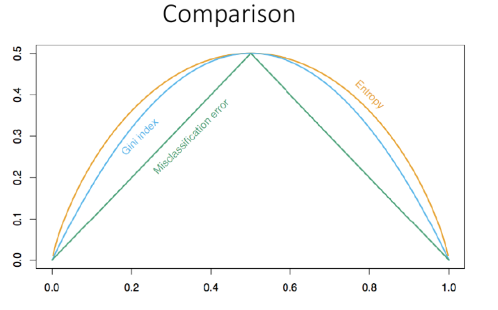

Для задач классификации обычно используется **Gini**, а для регрессии применяется другая метрика:

$$
I_V(X) = \sum_{x_i \in X} \sum_{x_j \in X} \frac{1}{2} (y_i - y_j)^2
$$

### Алгоритм построения дерева

1. Если все объекты в узле принадлежат одному классу, помечаем лист как этот класс и останавливаемся.
2. Ищем правило с наибольшим IG. Если ни одно правило не дает прироста информации, помечаем узел как принадлежащий к наибольшему классу и останавливаемся.
3. Разделяем узлы на детей по правилу.
4. Повторяем шаг 1 для каждого нового узла.

В случае регрессии возвращаем среднее значение вместо класса.

## 20.2 Глобальный поиск. Байесовская оптимизация. Функции выбора следующего измерения.

Смотри презентацию [ML_12_Bayes_and_DFO.pdf](https://docs.yandex.ru/docs/view?url=ya-disk-public%3A%2F%2FTce3Hg4R521%2FAeGvN14%2FuhhBJbYmfaf3PaCuY7embqZnn%2BiIO%2BBq00rZ5aTL40zE%2Bb3nCKLCVTJ%2BSInaOUvvHQ%3D%3D%3A%2F%D0%9B%D0%B5%D0%BA%D1%86%D0%B8%D0%B8%2FML_12_Bayes_and_DFO.pdf&name=ML_12_Bayes_and_DFO.pdf&nosw=1) ([папка](https://disk.yandex.ru/d/wyPHyCSqv_4ilg/%D0%9B%D0%B5%D0%BA%D1%86%D0%B8%D0%B8)).

Смотри последнюю лекцию (2024-12-16): таймкод 01:03:53 [Google Drive](https://drive.google.com/drive/folders/10gvaRHs_NQW4v5ULc5b6L83-pPs2zq6g).

---

**Байесовская оптимизация** применяется в ситуациях, когда проведение множества экспериментов невозможно, например, при бурении нефтяных скважин. Основная идея заключается в проведении эксперимента и пересчете распределения значений функции на основе предыдущих экспериментов для оценки вероятности каждого значения. Хорошо подходит нормальное распределение для значений функции в точке. Чем ближе точка к измерению, тем ближе её матожидание к значению измерения и меньше дисперсия.

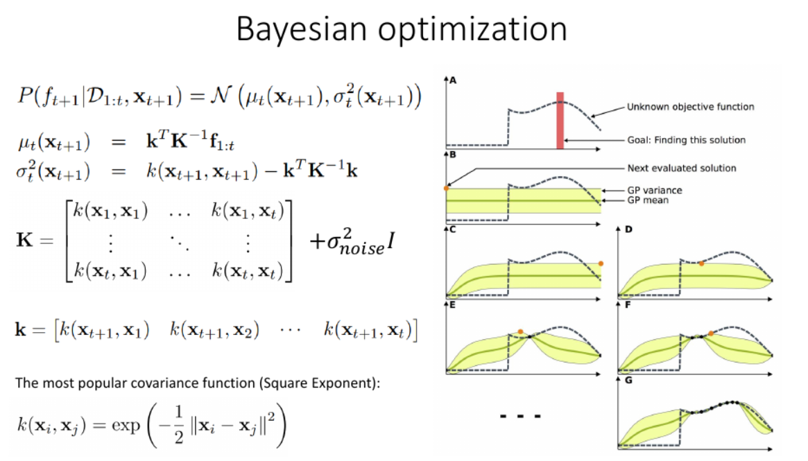

### Стратегии выбора точки

Функции выбора определяют новую точку для измерения:

1. **Ожидаемое улучшение (Expected Improvement)**:

$$
EI(x) = \mathbb{E} [\max(f(x) - f(x_{\text{best}}), 0)]
$$

3. **Верхняя граница доверительного интервала (Upper Confidence Bound)**:

$$
UCB(x) = \mu(x) + \beta\sigma(x)
$$

   где $\beta$ — параметр, определяемый пользователем.

3. **Вероятность улучшения (Probability of Improvement)**:

$$
PI(x) = P(f(x) > f(x_{\text{best}}))
$$

## Предсказание на доп вопросы
### 1
В регрессии количество листьев в дереве или $2^{\text{глубина}}$ определяет количество значений функции, так как каждый лист дает новое значение на каком-то промежутке.

Виды регуляризации деревьев (на самом деле другой билет):

1. Ограничение глубины дерева.
2. Минимальное количество точек в листе (разделяем новый лист, если в нем больше $k$ точек).
3. Минимальное количество точек в узле (начинаем разделять, если в ней больше $k$ точек).

Меньшее дерево снижает риск переобучения.

### 2
Как сделать первое измерение и какие начальные параметы (\mu(x) и \sigma(x)). Ответ: Я точный ответ не знаю, но сказал бы так. Сделаем первое в одном краю. Значение функции это начальное значение для матожидания. Чем ближе к краю тем меньше дисперсия вплоть до 0. Осталась проблема. Для некоторых функций выбора бесконечно много точек с лучшим значением, т.к. одиннаковое матожидание. По всем функциям выбора другой край одна из наилучших. Давайте для второго измерения возьмём её. Теперь у всех точек разные дисперсии и матожидания. Можем работать по алгоритму

