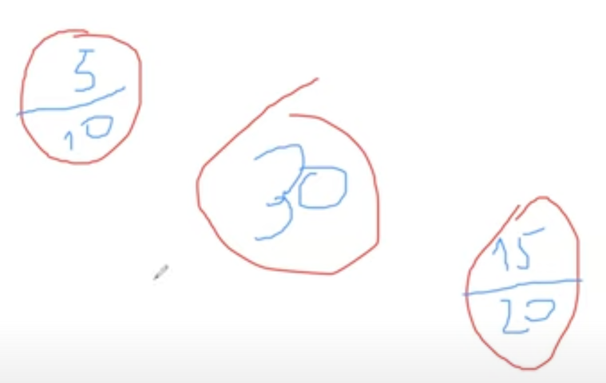
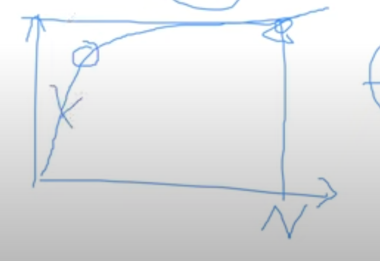
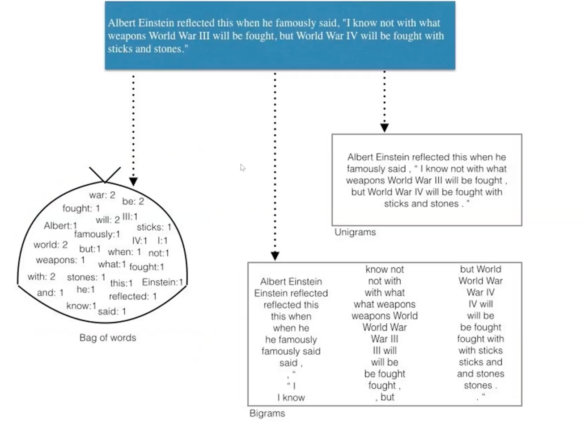

## 4.1. Кластеризация, метрики. Внешние метрики, homogeneity (purity). Внутренние метрики, silhouette, Dunn, Davies-Bouldin.

[Момент в лекции про метрики в кластеризации (YouTube)](https://youtu.be/mR3t3xN1J_I?si=Ww_9BlZ_pF4dfJUH)

[Момент в лекции про метрики в кластеризации (Google Диск)](https://drive.google.com/file/d/1LqQXsL31swEIHreAZL7ebXBRsjO-HeyA/view?usp=sharing&t=4503)

### Внешние метрики
Предполагают, что мы не решаем задачу кластеризации как 
она есть, а используем кластеризацию как способ получения 
новых знаний для решения каких-либо других задач. 
К примеру, мы можем получить новые фичи для решения задачи 
классификации (с помощью one-hot-encoding) с помощью кластеризации 
По большей части оцениваем как связаны классы с кластерами.

#### End metric (конечная метрика)

Настраиваем все параметры кластеризации так, чтобы максимизировать какое-то итоговое значение.
К примеру, делаем классификацию, по пути решаем задачу кластеризации для увеличения количества фич, 
пытаемся настроить параметры кластеризации так, 
чтобы получить наибольшее количество прибыли.
По сути, измеряем качество кластеризации по итоговой прибыли (или какому-либо еще значению), которое нужно максимизировать.

#### Homogeneity score (метрика гомогенности)

Метрика определяет долю максимального класса в кластере.

Значение метрики определяется по формуле: $$ \frac{1}{|D|} \sum_{i} max_{y} |x_i \in C_i, y_i = y| $$
Пояснение для картинки: каждый кружок соответствует кластеру и разбиение внутри кружочка - разбиение по классам.

Для случая с картинки:

$$ \frac{10+30+20}{15+30+35} $$

Идеальный homogeneity-score - это 1, поскольку это будет означать что каждый кластер гомогенен и все его элементы принадлежат одному классу.
Чем больше кластеров - тем метрика лучше.

Самая плохой homogeneity-score при n классах - это $$ \frac{1}{n} $$

При анализе кластеризации стараются взять такие параметры, 
которые соответствуют точке перегиба homogeneity-score. Почему не в точке, где N кластеров и homogeneity-score равен 1? У нас каждая точка образует свой кластер, само собой homogeneity-score будет 1, но такая кластеризация не очень полезна.

### Внутренние метрики

Пытаемся понять, какое разбиение на кластеры наилучшее, но не имеем какого-то конкретного известного разбиения на классы. 
Рассматриваем задачу кластеризации независимо, без привязки к классификации как во внешних метриках.

#### Silhouette coefficient

$$ s(x) = \frac{b(x)-a(x)}{max(a(x),b(x))} $$ где $a(x)$ - среднее расстояние от точки x до всех остальных точек в кластере, $b(x)$ - среднее расстояние от точки x до точек в соседнем, ближайшем кластере.

После подсчета $s(x)$ для каждой точки - считаем $s$ - среднее $s(x)$ для всех точек.

Хотим $s(x)$ - побольше, но происходит такая же проблема, что и с homogeneity-score - 1 будет достигаться при разделении всех точек на отдельные кластеры.

#### Dunn index

$$ D = \frac{min_{i\neq j}\rho(\mu_i,\mu_j)}{max_{x_i,x_j \in \mu}\rho(x_i,x_j)} $$

где $\mu$ - кластеры, $x_i$ - точки. 

Хотим максимизировать $D$ - хотим, чтобы расстояние внутри кластера было поменьше, а между кластерами - побольше.

Проблема Dunn index - в том, что $D$ учитывает в лучшем случае 3 кластера, для которых достигаются значения-экстремумы.

#### Davies-Bouldin index

$$ DB = \frac{1}{k} \sum_{i=1}^k max_{j \neq i} (\frac{\overline{\rho(\mu_i,x^i)}+\overline{\rho(\mu_j,x^j)}}{\rho(\mu_i,\mu_j)})$$

Здесь учитываем на все кластеры, но не на каждую точку.

$k$ - количество кластеров. Идем по всем кластерам, выбираем для каждого кластера другой, который максимизирует дробь. $\overline{\rho(\mu_j,x^j)}$ - среднее расстояние от точек кластера до центроида. 

$DB$ - хотим поменьше. 

## Наивный байесовский классификатор. Мультиномиальные, биномиальные и численные признаки.

[Момент из лекции](https://drive.google.com/file/d/1cudoqxGpoM6zgHVzmfwXNabFhIvktuK8/view?usp=sharing&t=1046)

Общая идея - хотим узнать принадлежит ли точка x классу $y$. Можем это сделать с помощью теоремы Байеса 

$$P(y|x) = \frac{P(y)P(x|y)}{P(x)}$$

где $P(y|x)$ - вероятность, что x принадлежит множеству y, $P(y)$ - вероятность, что вообще точка может принадлежать классу $y$, $P(x|y)$ - вероятность, что $x$ порождена классом $y$, $P(x)$ - вероятность, что может появиться точка $x$

В задаче классификации нам по большей части не нужно находить саму вероятность, нам нужно понять, на каком классе $y$ - она максимальна, так как нам нужно определить класс для $x$. Поэтому знаменатель $P(x)$ нам неинтересен - он не зависит от $y$

Тогда, класс $y$ для конкретного $x$ определится как 

$$y_{map} = \arg \max_{y \in Y} P(y|x) = \arg \max_{y \in Y} P(y)P(x|y) = \arg \max_{y \in Y} P(y)P(x_1,x_2,x_3...,x_n|y)$$

где $x_n$ - фичи $x$.

Сделаем наивное предположение, что фичи - независимы, тогда 

$$ P(x_1,x_2,x_3...,x_n|y) = P(x_1|y) \cdot P(x_2|y) \cdot ... \cdot P(x_n|y)$$

Классификатор, основанный на этом предположении - назовем наивным байесовским классификатором. Работает хорошо, когда фичей много. Первоначальное использование этого классификатора - это bag of words, когда фразе (документу) сопоставляется вектор со всеми словами из словаря, в котором указаны количества вхождений слова в фразу. 

Для такого анализа слов в документе - $P(y)$ - просто частота класса $y$, а $P(x_i = k | y)$ - доля документов в классе, для которых $x_i = k$. 

Можем обрезать гистограмму и делать последний столбик $\geq k$, 

Проблема такого подхода в том, что если хотя бы одна вероятность $x_i = k$ в классе $y$ равна 0, то обнулится вся вероятность (к примеру в классе спама ни в одном документе не встречалось слово купить трижды, тогда если оно встретилось трижды в письме, то вся вероятность занулится).

Решение - сделать сглаживание - создавать "виртуальный документ", в котором каждое слово встречается единожды. 

$$ P(x_i | y_i) = \frac{count(x_i,y_j)+1}{count(y_j)+k}$$

где $k$ - количество столбцов в гистограмме количества вхождения слова в документах в классе, а $ count(x_i,y_j) $ - сколько раз в классе $y_j$ в документах упоминалось проверяемое слово в количестве $x_i$ раз.

Гистограмма изменится вот так

Распределение, где каждая фича принимает определенный ограниченный набор значений - **мультиномиальная**. Такой фичей как раз и является количество вхождений слова в документ. Общий подход для них такой же, как и в случае, описанном выше для слов в документе.

#### Бинарные фичи
По сути бинарные фичи - это частный случай мультиномиальных, но можем расписать формулу вероятности конкретно для них:

Часто это удобнее, чем ходить и проверять ифами фича принимает значение 1 или нет. Вероятность $P(x_i = 1 | y)$ рассчитываем так же со сглаживанием.

#### Численные фичи

Пытаемся приблизить распределением, теперь вместо обычных вероятностей - плотности вероятностей.

Часто приближаем плотностью нормального распределения.

$$p(x_i | y) = \frac{1}{\sqrt{2\pi \sigma^2_y}} e^{-\frac{(x_i - \mu_y)^2}{2 \sigma^2_y}} $$

$\sigma^2_y$ - выборочная дисперсия по классу, $\mu_y$ - выборочное средние по классу.
У нас может возникнуть проблема, если фича не распределена нормально, к примеру распределена как синий график с картинки, тогда приближение нормальным даст распределение, которое указано зеленым, что весьма ошибочно.

Для этого нужно подмешивать несколько нормальных распределений с помощью EM-алгоритмов.

