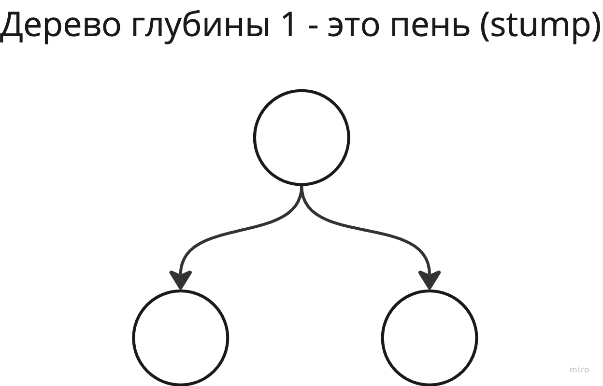

## 7.1. WkNN. Треугольное и экспоненциальное ядро. Метод окна Парцена.

Смотри презентацию [ML_01_kNN_ROC.pdf](https://docs.yandex.ru/docs/view?url=ya-disk-public%3A%2F%2FTce3Hg4R521%2FAeGvN14%2FuhhBJbYmfaf3PaCuY7embqZnn%2BiIO%2BBq00rZ5aTL40zE%2Bb3nCKLCVTJ%2BSInaOUvvHQ%3D%3D%3A%2F%D0%9B%D0%B5%D0%BA%D1%86%D0%B8%D0%B8%2FML_01_kNN_ROC.pdf&name=ML_01_kNN_ROC.pdf&nosw=1) (Слайды 22-25).

Смотри лекцию (за 2024-09-09): таймкод 01:17:30 [YouTube](https://youtu.be/AySw5WqkEKo?list=PLxMpIvWUjaJsttwLkYi-uEydy6R9Hk2-v&t=4650), [Google Drive](https://drive.google.com/drive/folders/1oAid_KeLC9P-_mvzrL-TT223MxnWHQB8).

## 7.2. Ансамбли. AdaBoost.

Смотри лекцию 12 (2024-12-09): [YouTube (01:17:30)](https://youtu.be/bZFIfWzVvUs?list=PLxMpIvWUjaJsttwLkYi-uEydy6R9Hk2-v&t=4650) или [Google Drive (01:17:30)](https://drive.google.com/drive/folders/1oAid_KeLC9P-_mvzrL-TT223MxnWHQB8).

Смотри презентацию [ML_11_Ensembles.pdf](https://docs.yandex.ru/docs/view?url=ya-disk-public%3A%2F%2FTce3Hg4R521%2FAeGvN14%2FuhhBJbYmfaf3PaCuY7embqZnn%2BiIO%2BBq00rZ5aTL40zE%2Bb3nCKLCVTJ%2BSInaOUvvHQ%3D%3D%3A%2F%D0%9B%D0%B5%D0%BA%D1%86%D0%B8%D0%B8%2FML_11_Ensembles.pdf&name=ML_11_Ensembles.pdf) (слайды 1-11).

---

**Для данного билета имеет смысл читать "Билет 2" с прошлого года** [здесь](https://quixotic-block-dc0.notion.site/2022-e10e3970e09f403cb3671981d4ecfef8#9bb9502033e648dd9cc36da321c83388) (делай `CTRL+F` по _"Ансамбли. Soft and Hard Voting. Bagging. Случайный лес. AdaBoost"_).

На всякий случай прикладываю скрины Notion, если вдруг нет доступа:

---

Про экстремально случайные леса можно послушать по таймкоду 01:27:32 ([YouTube](https://youtu.be/bZFIfWzVvUs?list=PLxMpIvWUjaJsttwLkYi-uEydy6R9Hk2-v&t=5252)).

Их осмысленно использовать в случаях, когда вероятность переобучения для алгоритмического решения очень высока. Тогда лучше не использовать вообще ни какой алгоритм, а воспользоваться экстремально случайными лесами:

---

#### Далее про AdaBoost (Adaptive Boosting)

**В лекции смотри таймкод 01:28:53** ([YouTube](https://www.youtube.com/watch?v=bZFIfWzVvUs&list=PLxMpIvWUjaJsttwLkYi-uEydy6R9Hk2-v&index=12&ab_channel=UniversityProgramsITMO%2CHSE)).

Проблема при экстремально случайные лесах заключается в том, что каждое следующее дерево никак не зависит от предыдущего (следующее дерево никак не учитывает то, что получилось при построении всех предыдущих).

Из этого вытекает идея: **более полезно рисовать какое-то дерево (смотреть с каким точками оно разобралось хорошо), а следующее дерево создавать так, чтобы оно разбиралось с теми точками, с которыми у предыдущего не получилось**. Так мы с каждым следующим деревом немного улучшаем, или бустим, нашу классифицирующую функцию.

Полный слайд:

